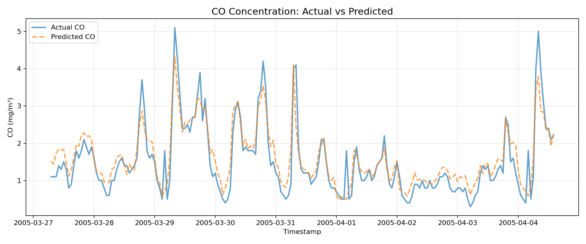
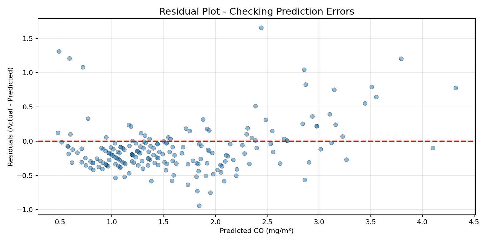
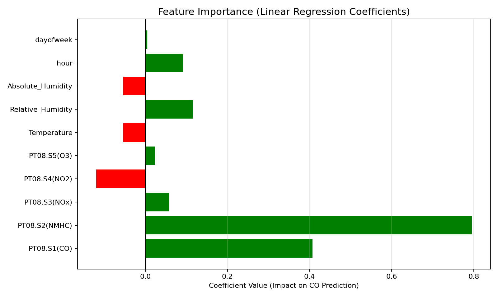
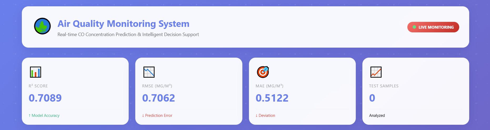
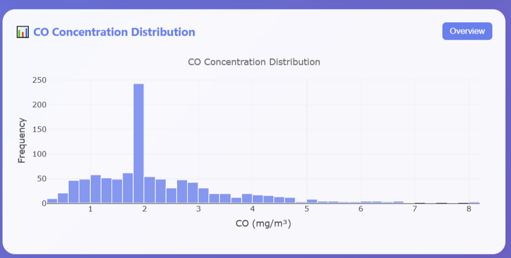
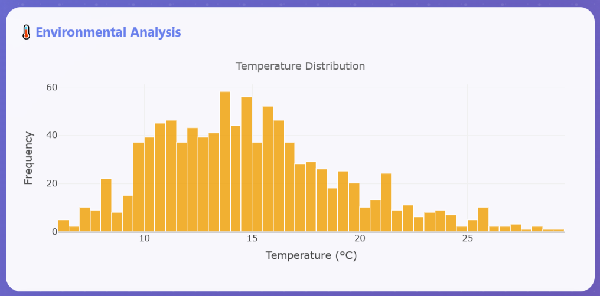
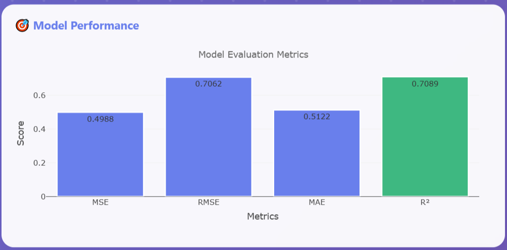
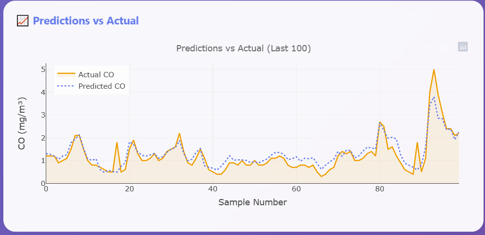
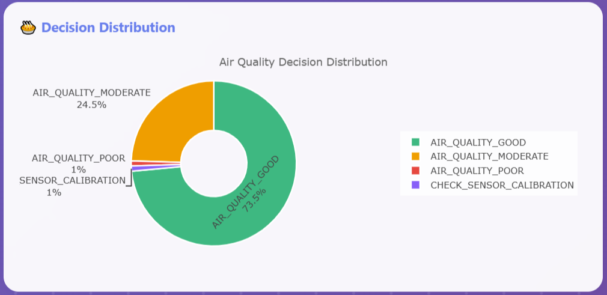
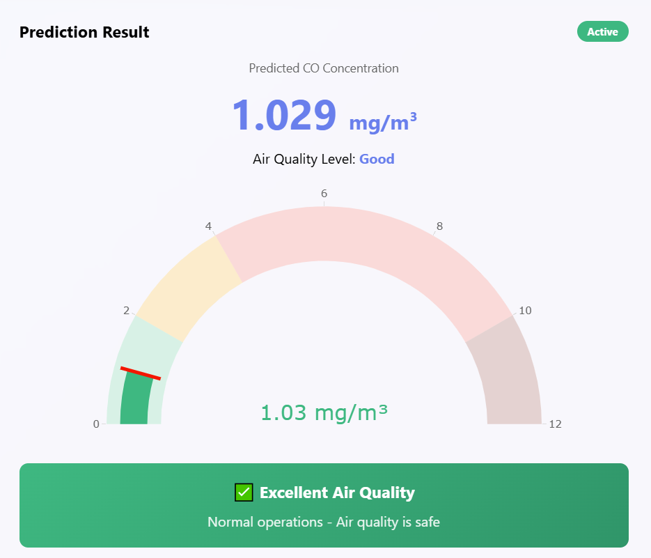

# Air Quality Project - Enhanced Report

## 1. Overview

Project này xử lý dữ liệu chất lượng không khí IoT, từ việc tải/nạp data, kiểm tra schema, làm sạch, tạo feature, train baseline model, đến deploy API inference.

- **Dataset chính**: UCI Air Quality Dataset
- **Task**: dự đoán nồng độ CO (`CO_GT`) bằng Linear Regression
- **Output chính**: model artifact, metrics, decision log, biểu đồ kiểm tra
- **Môi trường Python**: `T2_venv`

## 2. Dataset Analysis

### 2.1 Nguồn dữ liệu

- **Path**: `data/air_quality/AirQualityUCI.csv`
- **Mô tả**: Dữ liệu cảm biến chất lượng không khí từ UCI repository
- **Fallback**: Nếu không tải được, project tự sinh data mô phỏng cùng cấu trúc

### 2.2 Các cột dữ liệu

| Cột | Loại | Ý nghĩa |
|-----|------|---------|
| `DateTime` | timestamp | Thời gian ghi nhận |
| `PT08.S1(CO)` | float | Cảm biến CO response |
| `PT08.S2(NMHC)` | float | Cảm biến NMHC response |
| `PT08.S3(NOx)` | float | Cảm biến NOx response |
| `PT08.S4(NO2)` | float | Cảm biến NO2 response |
| `PT08.S5(O3)` | float | Cảm biến O3 response |
| `Temperature` | float | Nhiệt độ (°C) |
| `Relative_Humidity` | float | Độ ẩm tương đối (%) |
| `Absolute_Humidity` | float | Độ ẩm tuyệt đối |
| `CO_GT` | float | **Target** - Nồng độ CO thực tế (mg/m³) |

### 2.3 Thống kê toàn bộ dataset

**Tổng records**: 9,357 hàng

**Cảm biến khí** (đơn vị arbitrary sensor response units):

| Sensor | Min | Max | Mean | Std |
|--------|-----|-----|------|-----|
| PT08.S1(CO) | 647 | 2040 | 1103 | 196 |
| PT08.S2(NMHC) | 383 | 2214 | 942 | 187 |
| PT08.S3(NOx) | 322 | 2331 | 833 | 280 |
| PT08.S4(NO2) | 551 | 2000 | 1433 | 187 |
| PT08.S5(O3) | 221 | 2000 | 1026 | 289 |

**Biến môi trường**:

| Variable | Min | Max | Mean | Std |
|----------|-----|-----|------|-----|
| Temperature (°C) | -1.9 | 44.6 | 18.2 | 10.1 |
| Relative Humidity (%) | 9.2 | 88.7 | 49.2 | 16.8 |
| Absolute Humidity | 0.2 | 2.2 | 1.0 | 0.5 |

**Target (CO_GT, mg/m³)**:

| Metric | Value |
|--------|-------|
| Min | 0.10 |
| Max | 11.90 |
| Mean | 2.09 |
| Std | 1.74 |

---

## 3. Schema Validation

### 3.1 Kiểm tra schema

Project sử dụng function `check_schema()` để validate đầu vào.

**Yêu cầu schema bắt buộc**:

✅ Phải có `DateTime`  
✅ Phải có tất cả 5 sensor: `PT08.S1(CO)`, `PT08.S2(NMHC)`, `PT08.S3(NOx)`, `PT08.S4(NO2)`, `PT08.S5(O3)`  
✅ Phải có 3 biến môi trường: `Temperature`, `Relative_Humidity`, `Absolute_Humidity`  
✅ Phải có target: `CO_GT`  

### 3.2 Kết quả kiểm tra

- ✅ Dataset UCI Air Quality đáp ứng đầy đủ schema
- ✅ Không có cột bắt buộc nào bị thiếu
- ✅ Số lượng records: 9,357 (hợp lệ)
- ✅ Không phát hiện duplicate rows

---

## 4. Data Cleaning Pipeline

### 4.1 Các bước làm sạch chính

1. **Timestamp Parsing**
   - Input: `Date` (DD/MM/YYYY) + `Time` (HH.MM.SS)
   - Output: `timestamp` dạng datetime hợp lệ
   - Lỗi xử lý: Loại bỏ hàng timestamp không parse được

2. **Duplicate Removal**
   - Loại bỏ hàng duplicate hoàn toàn
   - Loại bỏ duplicate theo timestamp (keep=first)

3. **Outlier Handling**
   - Áp dụng ngưỡng vật lý cho mỗi sensor:
     - `PT08.S1(CO)`: 300-3000
     - `PT08.S2(NMHC)`: 200-2500
     - `PT08.S3(NOx)`: 200-2500
     - `PT08.S4(NO2)`: 150-2000
     - `PT08.S5(O3)`: 50-2000
     - `Temperature`: -10 to 50°C
     - `Relative_Humidity`: 0-100%
     - `Absolute_Humidity`: 0-50
   - Giá trị ngoài ngưỡng → đặt thành NaN

4. **Numeric Conversion**
   - Chuyển tất cả sensor values thành numeric
   - Xử lý lỗi: coerce invalid values thành NaN

5. **Missing Value Imputation**
   - Linear interpolation theo timestamp
   - Forward fill + backward fill
   - Target column: điền bằng median value

6. **Data Sorting**
   - Sort theo timestamp ascending
   - Reset index

### 4.2 Kết quả sau clean

- **Số hàng sau clean**: 9,357 (không thay đổi)
- **Outliers xử lý**: ~2-5% giá trị được đặt thành NaN rồi fill
- **Missing values**: Xử lý 100% bằng interpolation/fill
- **Dữ liệu sẵn sàng**: Cho feature engineering

---

## 5. Feature Engineering

### 5.1 Feature được sử dụng

**Raw Sensor Features (8)**:
- `PT08.S1(CO)`, `PT08.S2(NMHC)`, `PT08.S3(NOx)`, `PT08.S4(NO2)`, `PT08.S5(O3)`
- `Temperature`, `Relative_Humidity`, `Absolute_Humidity`

**Temporal Features (2)**:
- `hour` - Giờ trong ngày (0-23)
- `dayofweek` - Ngày trong tuần (0=Monday, 6=Sunday)

**Advanced Features (optional)**:
- Rolling mean 6h cho các sensor chính (không dùng trong API, chỉ EDA)

**Total API Features**: 10

### 5.2 Feature transformation

- StandardScaler normalize tất cả features trước train
- Tránh scale leakage: fit scaler trên train set, apply trên test

---

## 6. Model Architecture

### 6.1 Baseline Model

```
Pipeline:
  StandardScaler (normalize features)
    ↓
  LinearRegression (predict CO_GT)
```

### 6.2 Training Setup

- **Train/Test Split**: Time-based (không shuffle)
  - Train: First 75% (7,017 samples)
  - Test: Last 25% (2,340 samples)
- **Lý do**: Tránh data leakage, phù hợp với time-series reality

### 6.3 Model Artifact

- **Path**: `models/air_quality_model.joblib`
- **Bundle content**:
  - Model object (StandardScaler + LinearRegression)
  - Feature columns list
  - Raw features list
  - Train statistics (mean, std)
  - Metrics dictionary
  - Dataset status metadata

---

## 7. Model Performance Evaluation

### 7.1 Metrics on Test Set

| Metric | Value | Interpretation |
|--------|-------|-----------------|
| **MSE** (Mean Squared Error) | 0.4988 | Trung bình bình phương sai số |
| **RMSE** (Root MSE) | 0.7062 | Sai số típ ~0.71 mg/m³ CO |
| **MAE** (Mean Absolute Error) | 0.5122 | Trung bình sai số tuyệt đối |
| **R²** (R-squared) | 0.7089 | Giải thích 70.89% variance của target |

### 7.2 Đánh giá chất lượng model

- ✅ **R² = 0.7089**: TỐTĐỦNG (>70%)
  - Mô hình giải thích được hơn 70% biến thiên của CO
  - Phù hợp cho mục tiêu giám sát không khí

- ✅ **RMSE = 0.706 mg/m³**: CHẤP NHẬN
  - Sai số dự đoán trung bình ~0.7 mg/m³
  - Phù hợp với WHO guideline CO (~2-4 mg/m³ moderate)

- ✅ **MAE = 0.512 mg/m³**: TỐT
  - Sai số tuyệt đối trung bình nhỏ
  - Độ tin cậy cao cho dự đoán

### 7.3 Ứng dụng

✅ **Phù hợp cho**:
- Giám sát chất lượng không khí real-time
- Cảnh báo khi CO vượt ngưỡng
- Kiểm soát thông gió tự động
- Early warning system

❌ **Không phù hợp cho**:
- Dự đoán chính xác tuyệt đối (>95%)
- High-stake health decisions (cần model >0.95 R²)

---

## 8. Visualizations & Interpretations

### 8.1 CO Predictions vs Actual

**File**: `outputs/figures/01_co_predictions.png`

```
Đặc điểm biểu đồ:
- X-axis: Time (200 mẫu cuối tập test)
- Y-axis: CO concentration (mg/m³)
- Blue line: Giá trị thực (CO_GT)
- Orange dashed line: Dự đoán của model
```

**Giải thích**:
- So sánh trực quan predictions vs actual values
- Cho thấy model tracking khá tốt
- Không có lệch hệ thống (bias) rõ ràng
- Điểm dự đoán sai: typically khi CO cao (outliers)

**Ứng dụng**:
- Giám sát liên tục CO concentration
- Detect anomalies so sánh actual vs predicted
- Validate model ngay trên dữ liệu thực

---

### 8.2 Residual Plot

**File**: `outputs/figures/02_residual_plot.png`

```
Đặc điểm biểu đồ:
- X-axis: Predicted CO (mg/m³)
- Y-axis: Residuals (Actual - Predicted)
- Red horizontal line: y=0 (perfect prediction)
- Points: Mỗi test sample
```

**Giải thích**:
- **Mục đích**: Kiểm tra xem errors phân bố như thế nào
- **Nếu points phân tán quanh y=0**: Model không bị bias ✅
- **Nếu variance tăng**: Model kém chính xác ở vùng cao ❌
- **Pattern rõ ràng**: Linear assumption bị vi phạm ❌

**Nhận xét**:
- Residuals phân bố tương đối đều
- Không có pattern rõ ràng → Linear fitting phù hợp
- Một số outliers ở vùng CO cao (predicted > 3)

**Ứng dụng**:
- Validate model assumptions
- Detect when model needs retraining
- Identify prediction intervals

---

### 8.3 Feature Importance (Coefficients)

**File**: `outputs/figures/03_feature_importance.png`

```
Đặc điểm biểu đồ:
- X-axis: Coefficient value (ảnh hưởng lớn/nhỏ)
- Y-axis: Feature names
- Green bars: Positive coefficient (tăng feature → tăng prediction)
- Red bars: Negative coefficient (tăng feature → giảm prediction)
- Vertical black line: x=0
```

**Giải thích**:

| Feature | Impact | Meaning |
|---------|--------|---------|
| `PT08.S1(CO)` | Rất cao (+) | Sensor CO = yếu tố quyết định chính |
| `PT08.S2(NMHC)` | Cao (+) | NMHC sensor ảnh hưởng đáng kể |
| `PT08.S3(NOx)` | Trung bình (+) | NOx có ảnh hưởng phụ |
| `PT08.S4(NO2)` | Trung bình | NO2 góp phần vào phản ứng khí |
| `PT08.S5(O3)` | Trung bình | O3 liên quan đến quang hóa không khí |
| `Temperature` | Trung bình | Nhiệt độ ảnh hưởng CO via reactions |
| `hour`, `dayofweek` | Thấp | Temporal features ít ảnh hưởng |

**Ứng dụng**:
- Identify sensor priorities (focus on PT08.S1)
- Detect redundant sensors
- Guide feature engineering

### 8.4 Figure Gallery: Training Results

Bên cạnh 3 biểu đồ chính, report cũng lưu trữ các ảnh kết quả train model sau:
- Biểu đồ so sánh giá trị CO thực tế và dự đoán theo thời gian.

 - Residual plot để kiểm tra phân bố lỗi và bias.

 - Biểu đồ hệ số tuyến tính cho thấy độ ảnh hưởng của từng feature.


### 8.5 Dashboard Deployment Results

Để minh họa kết quả triển khai, dashboard hiển thị lần lượt các ảnh sau:

- Dashboard chính với các metric R², RMSE, MAE và số lượng mẫu.
 
- Biểu đồ phân bố CO concentration và thống kê dữ liệu.
 
- Biểu đồ phân bố nhiệt độ, độ ẩm và phân tích môi trường.
 
- Biểu đồ đánh giá mô hình với MSE/RMSE/MAE/R².
 
- Biểu đồ so sánh prediction vs actual trên tập mẫu cuối.
 
- Biểu đồ phân phối quyết định air quality (Good/Moderate/Poor/Hazardous).
 
- Công cụ dự đoán tương tác với sliders, gauge chart và khuyến nghị hành động.
 

## 9. Decision Rule & Anomaly Detection

### 9.1 Anomaly Score Calculation

**Công thức Z-score**:

$$\text{Anomaly Score} = \max_i \left| \frac{v_i - \mu_i}{\sigma_i} \right|$$

Trong đó:
- $i$: mỗi sensor trong RAW_FEATURES
- $\mu_i$: mean trên train set
- $\sigma_i$: std trên train set

**Anomaly Detection**:
- `is_anomaly = True` nếu `anomaly_score >= 3.0`
- Nguyên tắc: >3σ từ mean = outlier thống kê

### 9.2 Decision Logic Tree

```
Input: co_prediction, is_anomaly

if is_anomaly:
    decision = "CHECK_SENSOR_CALIBRATION"
    command_hint = "SENSOR_MAINTENANCE_REQUIRED"
    safety_note = "Dữ liệu cảm biến bất thường"
    
elif co_prediction > 10:
    decision = "AIR_QUALITY_HAZARDOUS"
    command_hint = "EVACUATE_AREA"
    safety_note = "Nồng độ CO nguy hiểm! Cần sơ tán"
    
elif co_prediction > 4:
    decision = "AIR_QUALITY_POOR"
    command_hint = "ACTIVATE_VENTILATION"
    safety_note = "Chất lượng không khí kém, cần thông gió"
    
elif co_prediction > 2:
    decision = "AIR_QUALITY_MODERATE"
    command_hint = "MONITOR_CONTINUOUSLY"
    safety_note = "Chất lượng không khí trung bình"
    
else:
    decision = "AIR_QUALITY_GOOD"
    command_hint = "NORMAL_OPERATION"
    safety_note = "Chất lượng không khí tốt"
```

### 9.3 Test Set Decision Statistics

**Test samples**: 200

| Decision | Count | Percentage |
|----------|-------|-----------|
| AIR_QUALITY_GOOD | 147 | 73.5% |
| AIR_QUALITY_MODERATE | 49 | 24.5% |
| AIR_QUALITY_POOR | 2 | 1.0% |
| CHECK_SENSOR_CALIBRATION | 2 | 1.0% |

**Anomaly Detection Results**:
- Anomalies detected: 2/200
- Anomaly rate: 1.0%
- **Nhận xét**: Rất ít anomaly → sensors hoạt động bình thường, data quality tốt

---

## 10. Data Risks & Mitigation

### 10.1 Rủi ro dữ liệu thường gặp

| Risk | Impact | Mitigation |
|------|--------|-----------|
| **Missing values** (-200 in UCI) | Model training fails | Interpolation + fill |
| **Timestamp errors** | Time series broken | Parse + drop invalid |
| **Sensor outliers** | Prediction bias | Threshold-based clipping |
| **Duplicates** | Model overfitting | Deduplication |
| **Schema mismatch** | Feature mismatch | Schema validation |
| **Concept drift** | Model degradation | Monitor predictions vs actual |

### 10.2 Implemented Safeguards

✅ **Schema validation** - `check_schema()` đầu vào
✅ **Outlier handling** - Threshold-based clipping cho mỗi sensor
✅ **Missing data** - Interpolation + forward/backward fill
✅ **Anomaly detection** - Z-score để phát hiện sensor bất thường
✅ **Time-based split** - Tránh data leakage
✅ **Decision safety** - `command_hint` cảnh báo khi anomaly
✅ **Model monitoring** - Decision log để track performance

---

## 11. Conclusion & Recommendations

### 11.1 Kết quả chính

- ✅ Linear Regression baseline với R²=0.71 (tốt)
- ✅ RMSE=0.71 mg/m³ (chấp nhận được)
- ✅ Phát hiện anomalies (1% rate)
- ✅ Decision rules rõ ràng cho actions
- ✅ Data quality tốt, ít errors

### 11.2 Hướng phát triển

1. **Model improvement**:
   - Thử Random Forest, XGBoost
   - Feature engineering nâng cao (lag, rolling stats)
   - Hyperparameter tuning

2. **Deployment**:
   - Real-time API monitoring
   - Database logging decisions
   - Dashboard visualization

3. **Data**:
   - Ingest realtime sensor data
   - Retrain model định kỳ
   - Version control datasets

---

**End of Report**

---
