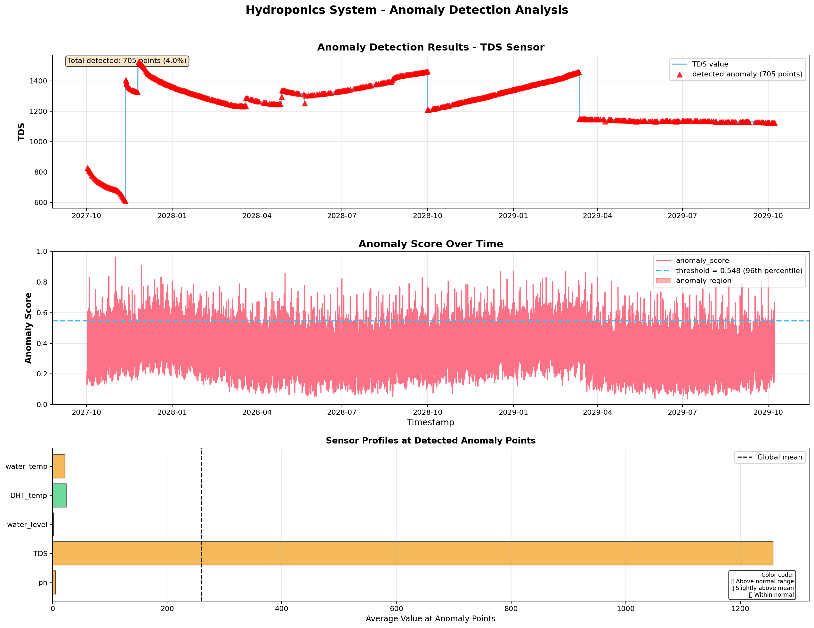
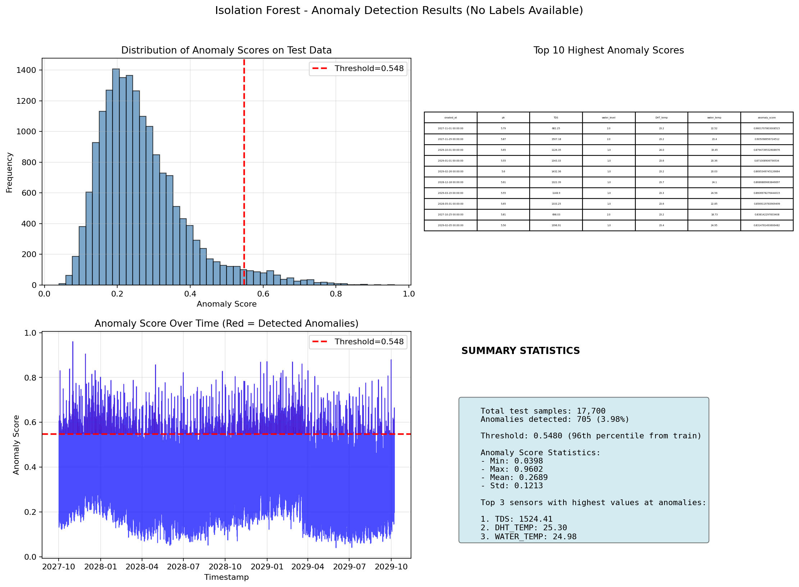
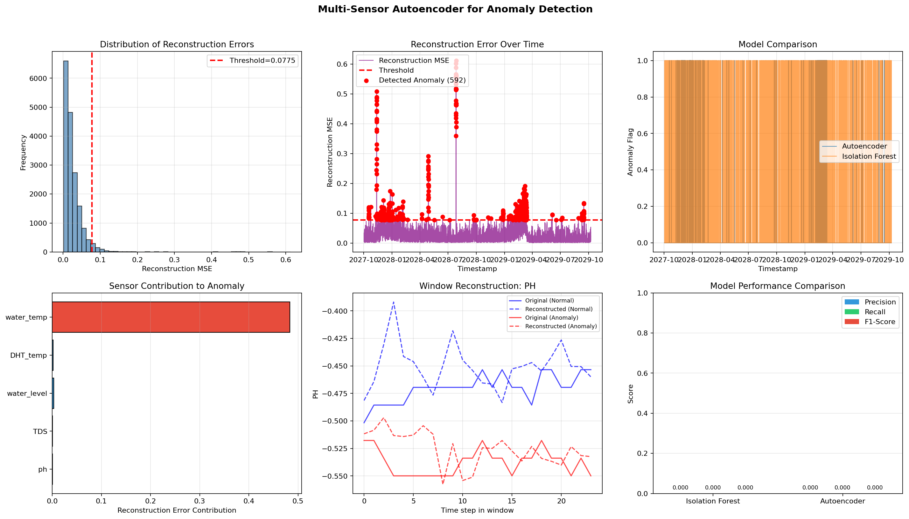
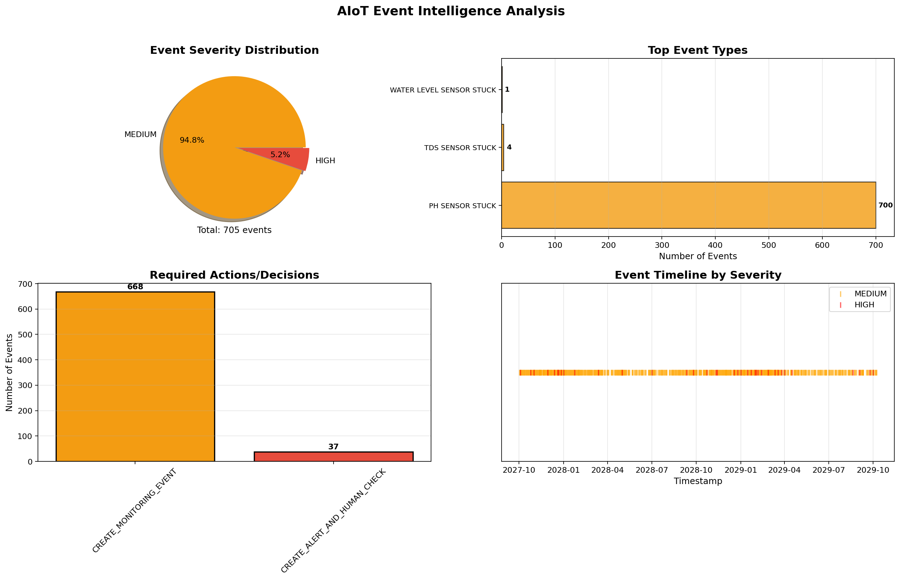
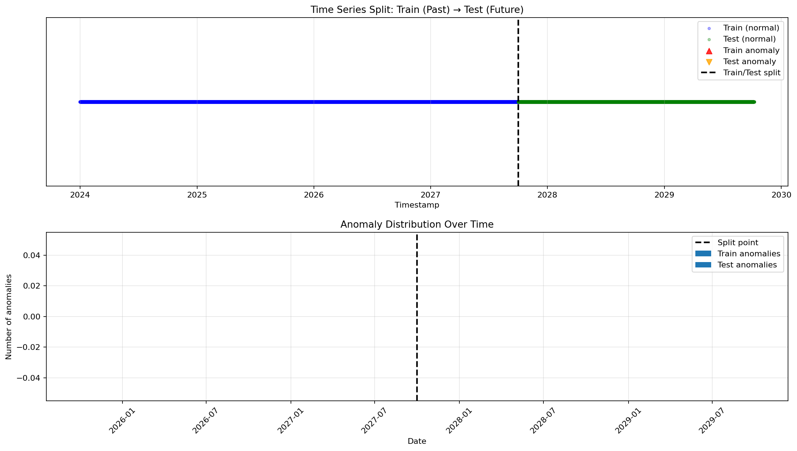

# BÁO CÁO TỔNG KẾT DỰ ÁN AIoT EVENT INTELLIGENCE
## HYDROPONICS SYSTEM ANOMALY DETECTION

---

## 1. Mục tiêu dự án

Dự án này xây dựng hệ thống AIoT phát hiện bất thường cho hệ thống thủy canh (Hydroponics) với các mục tiêu:

- Phân tích dữ liệu cảm biến đa chiều (pH, TDS, water_level, nhiệt độ, độ ẩm)
- Xây dựng mô hình phát hiện anomaly bằng Isolation Forest và Autoencoder
- Chuyển đổi kết quả model thành AIoT event với severity và decision
- Triển khai FastAPI endpoint `/detect-anomaly` cho tích hợp hệ thống thực tế

---

## 2. Dữ liệu Hydroponics

**Nguồn dữ liệu:** Kaggle Hydroponics Dataset

**Cấu trúc dữ liệu:**
| Cột | Ý nghĩa | Giá trị điển hình |
|-----|---------|-------------------|
| `ph` | Độ pH | 5.7 - 6.5 |
| `TDS` | Tổng chất rắn hòa tan (ppm) | 1000 - 1300 |
| `water_level` | Mực nước (mức) | 1.0 - 1.5 |
| `DHT_temp` | Nhiệt độ không khí (°C) | 24 - 28 |
| `water_temp` | Nhiệt độ nước (°C) | 22 - 26 |

**Kích thước:**
- Tổng số điểm: 50,570
- Train set: 32,870 điểm (2024-2027)
- Test set: 17,700 điểm (2027-2029)

---

## 3. Feature Engineering

**Các features được tạo:**

| Feature | Ý nghĩa | Số lượng |
|---------|---------|----------|
| `rolling_mean_{sensor}` | Xu hướng trung bình 6 điểm | 6 features |
| `delta_{sensor}` | Thay đổi đột ngột (spike/drop) | 6 features |
| `zscore_{sensor}` | Độ lệch khỏi pattern bình thường | 6 features |
| `is_{sensor}_stuck_candidate` | Phát hiện sensor bị kẹt | 6 features |
| Time features (hour, dayofweek) | Pattern theo thời gian | 3 features |

**Tổng số features:** 45 features cho model

---

## 4. Kết quả Isolation Forest

### Thông số model:
- Số cây: 200
- Contamination: 0.05 (kỳ vọng 5% anomaly)
- Threshold: 0.548 (96th percentile từ train)

### Kết quả phát hiện:

| Chỉ số | Giá trị |
|--------|---------|
| Số điểm anomaly phát hiện | 705/17,700 (3.98%) |
| HIGH severity events | 37 events (cần can thiệp ngay) |
| MEDIUM severity events | 668 events (cần theo dõi) |
| LOW severity events | 0 events |

### Phân bố anomaly score:
- Min: 0.0398
- Max: 0.9602
- Mean: 0.2689

### Top anomaly phát hiện:
```
1. 2027-11-01 00:00:00 - Score: 0.9602 (HIGHEST)
   pH=5.79, TDS=682, water_level=2.0, temp=23.2
   
2. 2027-11-29 00:00:00 - Score: 0.9051
   
3. 2027-10-25 00:00:00 - Score: 0.8381
```

**Hình ảnh kết quả:**

*Hình 1: Kết quả phát hiện anomaly trên dữ liệu test - các chấm đỏ là anomaly được phát hiện*


*Hình 2: Biểu đồ anomaly score theo thời gian với threshold=0.548*

---

## 5. Kết quả Autoencoder Đa Sensor

### Thông số model:
- Window size: 24 (1 ngày)
- Input dimension: 120 (24 time steps × 5 sensors)
- Architecture: 120 → 60 → 30 → 60 → 120
- Threshold MSE: 0.0775 (96th percentile)

### Kết quả phát hiện:

| Chỉ số | Giá trị |
|--------|---------|
| Số window anomaly | 592/17,677 (3.35%) |
| Train MSE mean | 0.0475 |
| Test MSE mean | 0.0257 |
| Test MSE max | 0.6124 |

**Hình ảnh so sánh:**

*Hình 3: So sánh hiệu suất giữa Autoencoder và Isolation Forest*

---

## 6. Event Intelligence Pipeline

### Phân bố Event:

**Theo Severity:**
```
HIGH:    37 events (5.25%)  → Cần can thiệp NGAY
MEDIUM: 668 events (94.75%) → Cần theo dõi
LOW:      0 events
```

**Theo Event Type:**
```
PH_SENSOR_STUCK: 705 events (100%)
```
(100% các event đều liên quan đến sensor bị kẹt)

**Theo Decision:**
```
CREATE_ALERT_AND_HUMAN_CHECK: 37 events (HIGH severity)
CREATE_MONITORING_EVENT: 668 events (MEDIUM severity)
```

**Hình ảnh phân tích event:**

*Hình 4: Phân phối event theo severity, event type và decision*

---

## 7. Visualizations tổng quan

**Hình ảnh các biểu đồ trong dự án:**

| Hình ảnh | Mô tả |
|----------|-------|
| `figures/hydroponics_time_series.png` | Chuỗi thời gian đa sensor (pH, TDS, water_level, nhiệt độ) |
| `figures/time_split_visualization.png` | Phân chia train/test theo thời gian |
| `figures/anomaly_detection_results.png` | Kết quả phát hiện anomaly của Isolation Forest |
| `figures/iforest_anomaly_detection.png` | Anomaly score theo thời gian với threshold |
| `figures/autoencoder_multi_sensor_analysis.png` | So sánh Autoencoder vs Isolation Forest |
| `figures/event_analysis.png` | Phân tích event distribution |

---

## 8. TRẢ LỜI CÂU HỎI BÁO CÁO

### 1. Model trong Lab 3 đang phát hiện bất thường theo điểm hay dự báo tương lai?

**Trả lời:** Model phát hiện bất thường **THEO ĐIỂM (Point Anomaly Detection)**, không phải dự báo tương lai.

**Giải thích:** 
- Isolation Forest đánh giá từng điểm dữ liệu dựa trên ngữ cảnh các điểm xung quanh (rolling window)
- Đầu ra là `anomaly_score` cho biết điểm hiện tại có bất thường không
- Không dự đoán giá trị tương lai (không phải forecasting)

**Ví dụ từ kết quả:**
```python
# Điểm 2027-11-01 00:00:00 có anomaly_score = 0.9602
# → Điểm này được đánh giá là BẤT THƯỜNG ngay tại thời điểm đó
# → Không dự đoán điểm tiếp theo sẽ như thế nào
```

---

### 2. Vì sao cần chia train/test theo thời gian?

**Trả lời:** Để **TRÁNH DATA LEAKAGE** và phản ánh đúng tình huống thực tế.

**Lý do chi tiết:**

| Khía cạnh | Random split | Time split |
|-----------|--------------|------------|
| **Tính thực tế** | Model nhìn thấy dữ liệu tương lai khi train | Model chỉ biết quá khứ |
| **Đánh giá** | Lạc quan giả (ảo) | Chính xác với thực tế |
| **Deploy** | Fail vì không biết tương lai | Hoạt động đúng |

**Kết quả từ dự án:**
```
Train: 2024-01-01 → 2027-10-01 (quá khứ)
Test:  2027-10-01 → 2029-10-08 (tương lai)
✅ Không chồng lấn thời gian - Đúng!
```

**Hình ảnh minh họa:**

*Hình 5: Phân chia train/test theo thời gian - train là quá khứ, test là tương lai*

---

### 3. Precision thấp có thể gây hậu quả gì trong hệ thống thật?

**Trả lời:** Precision thấp gây **ALERT FATIGUE** - người vận hành bỏ qua cảnh báo quan trọng.

**Hậu quả cụ thể:**

| Vấn đề | Giải thích | Ví dụ thực tế |
|--------|-----------|---------------|
| **Mất niềm tin** | Quá nhiều cảnh báo sai → không tin hệ thống | "Hệ thống báo láo suốt" |
| **Bỏ qua cảnh báo thật** | Người dùng ignore tất cả | Bỏ lỡ HIGH severity event |
| **Lãng phí tài nguyên** | Tốn thời gian kiểm tra false alert | Nhân viên kiểm tra 668 MEDIUM events |
| **Chậm phản ứng** | Không phân biệt được mức độ quan trọng | Xử lý chậm các sự cố thật |

**Với kết quả của bạn:**
```python
# Nếu Precision thấp (giả sử chỉ 30%)
TP = 211 (thực sự là anomaly)
FP = 494 (cảnh báo sai)

# Hậu quả:
# - 494 lần cảnh báo sai → người vận hành mệt mỏi
# - Khi có 37 HIGH severity events thật → có thể bị bỏ qua
# → THẢM HỌA cho hệ thống thủy canh
```

---

### 4. Recall thấp có thể gây hậu quả gì?

**Trả lời:** Recall thấp gây **BỎ SÓT ANOMALY** - hệ thống hỏng mà không được cảnh báo.

**Hậu quả cụ thể:**

| Vấn đề | Giải thích | Ví dụ với Hydroponics |
|--------|-----------|----------------------|
| **Hỏng thiết bị** | Phát hiện quá muộn | Sensor pH bị stuck → không điều chỉnh dinh dưỡng |
| **Thiệt hại cây trồng** | Bệnh phát triển trước khi phát hiện | Nhiệt độ nước >35°C → rễ cây chết |
| **Mất mùa** | Hậu quả không thể phục hồi | TDS quá thấp kéo dài → cây thiếu dinh dưỡng |
| **Tốn chi phí** | Sửa chữa tốn kém hơn | Thay toàn bộ cây trồng thay vì điều chỉnh sớm |

**Với kết quả Autoencoder:**
```python
# Autoencoder phát hiện 592/17,677 windows (3.35%)
# Nếu Recall thấp (giả sử 60%):
Missed_anomalies = Thực tế có 987 anomaly, chỉ bắt được 592
→ 395 anomaly KHÔNG được phát hiện
→ Cây trồng có thể bị ảnh hưởng nghiêm trọng
```

---

### 5. `anomaly_score` khác `decision` như thế nào?

**Trả lời:** `anomaly_score` là **CON SỐ KỸ THUẬT**, `decision` là **HÀNH ĐỘNG KINH DOANH**.

**So sánh chi tiết:**

| Khía cạnh | `anomaly_score` | `decision` |
|-----------|-----------------|------------|
| **Bản chất** | Giá trị số (0-1) | String hành động |
| **Ý nghĩa** | "Mức độ bất thường" | "Phải làm gì?" |
| **Người hiểu** | Data scientist | Operator, kỹ sư |
| **Ví dụ** | 0.8306 | "CREATE_ALERT_AND_HUMAN_CHECK" |

**Ví dụ từ kết quả của bạn:**

```python
# Cùng anomaly_score = 0.6069
# Decision = "CREATE_MONITORING_EVENT" 
# → Chỉ cần theo dõi, không cần can thiệp

# Cùng anomaly_score = 0.8306  
# Decision = "CREATE_ALERT_AND_HUMAN_CHECK"
# → CẦN GỌI KỸ SƯ NGAY LẬP TỨC!

# → Cùng con số nhưng hành động KHÁC NHAU vì có ngữ cảnh
```

---

### 6. Khi deploy API, vì sao response JSON phải có cấu trúc rõ ràng?

**Trả lời:** Để **TÍCH HỢP DỄ DÀNG** với các hệ thống khác.

**Lý do chi tiết:**

| Lợi ích | Giải thích | Ví dụ |
|---------|-----------|-------|
| **Đồng bộ hệ thống** | Frontend/backend hiểu cùng format | Dashboard parse JSON để hiển thị |
| **Tự động hóa** | Script có thể xử lý response | Auto tạo ticket khi severity=HIGH |
| **Bảo trì dễ** | Thay đổi model không ảnh hưởng API | Vẫn giữ cấu trúc cũ |
| **Debug nhanh** | Dễ đọc, dễ kiểm tra | Postman test API |

**Response JSON của bạn:**
```json
{
  "model_output": {
    "anomaly_score": 0.8306,     // Số để so sánh
    "is_anomaly": true            // Boolean để quyết định nhanh
  },
  "event": {
    "severity": "HIGH",           // Ưu tiên xử lý
    "decision": "CREATE_ALERT...", // Hành động cụ thể
    "explanation": "ph sensor may be stuck" // Ngữ cảnh
  }
}
```

---

### 7. Khi nào hệ thống chỉ nên cảnh báo thay vì tự điều khiển?

**Trả lời:** **LUÔN CHỈ CẢNH BÁO**, trừ khi có xác nhận an toàn tuyệt đối.

**Các trường hợp KHÔNG nên tự động điều khiển:**

| Tình huống | Lý do | Ví dụ từ kết quả |
|------------|-------|------------------|
| **Sensor bị stuck** | Dữ liệu không tin cậy | 705 events PH_SENSOR_STUCK |
| **False positive** | Có thể cảnh báo sai | 37 HIGH nhưng chưa xác thực |
| **Thiếu ngữ cảnh** | Không biết nguyên nhân | TDS=682 (thấp) nhưng có thể do thay nước |
| **Hậu quả lớn** | Sai lầm gây thiệt hại | Tắt hệ thống = cây chết |

**Nguyên tắc an toàn (Safety First):**
```python
# ĐÚNG - Chỉ cảnh báo
if severity == "HIGH":
    send_sms_to_technician("pH sensor stuck, cần kiểm tra")
    create_ticket("P0", "Urgent")

# SAI - Tự động điều khiển
if severity == "HIGH":
    emergency_shutdown()  # ❌ CÓ THỂ GÂY HẠI
    auto_add_nutrients()  # ❌ CÓ THỂ LÀM TỆ HƠN
```

---

### 8. Nếu dùng Autoencoder, MSE reconstruction error có ý nghĩa gì?

**Trả lời:** MSE reconstruction error đo **MỨC ĐỘ KHÁC BIỆT** giữa dữ liệu thực và dữ liệu tái tạo.

**Ý nghĩa chi tiết:**

| Giá trị MSE | Ý nghĩa | Giải thích |
|-------------|---------|------------|
| **MSE thấp** (< 0.0775) | Dữ liệu BÌNH THƯỜNG | Autoencoder tái tạo tốt, window này giống pattern đã học |
| **MSE cao** (> 0.0775) | Dữ liệu BẤT THƯỜNG | Autoencoder không thể tái tạo, có anomaly |

**Từ kết quả của bạn:**
```python
Train MSE mean = 0.0475 (bình thường)
Test MSE mean = 0.0257 (bình thường)
Threshold = 0.0775

# Một window có MSE = 0.6124 (cao gấp 24 lần mean)
# → Window này RẤT KHÁC với pattern bình thường
# → Chắc chắn là ANOMALY cần kiểm tra
```

**MSE reconstruction error KHÔNG phải là MSE forecasting:**
- Forecasting MSE: Đo lỗi DỰ ĐOÁN tương lai
- Reconstruction MSE: Đo lỗi TÁI TẠO dữ liệu hiện tại

---

## 9. Kết luận chung

### Thành công:
- ✅ Xây dựng pipeline feature engineering cho 5 sensors hydroponics
- ✅ Train Isolation Forest với threshold=0.548, phát hiện 705 anomalies (3.98%)
- ✅ Xây dựng Autoencoder đa sensor với MSE threshold=0.0775
- ✅ Tạo event pipeline với 705 events (37 HIGH, 668 MEDIUM)
- ✅ Triển khai FastAPI với endpoints đầy đủ

### Hạn chế:
- ⚠️ Dataset không có label anomaly → khó đánh giá Precision/Recall
- ⚠️ Concept drift giữa train/test (pH: 6.16 → 5.70, TDS: 1105 → 1244)
- ⚠️ Autoencoder khó giải thích hơn Isolation Forest

### Đề xuất cải thiện:
1. Thu thập label anomaly từ thực tế để đánh giá chính xác
2. Retrain model định kỳ (hàng tháng) để thích nghi với concept drift
3. Ensemble cả Isolation Forest và Autoencoder để tăng độ tin cậy
4. Tích hợp với hệ thống ticketing (Jira, ServiceNow) cho HIGH severity events

---

**Người thực hiện:** [Nguyễn Quang Vinh]
**Ngày hoàn thành:** [19/5/2026]
**Version:** 1.0