# BÁO CÁO LAB 5 V4

## Triển khai AI Inference Service với FastAPI và Docker

---

# 1. Thông tin sinh viên

| Nội dung       | Thông tin |
| -------------- | --------- |
| Họ và tên      | Nguyễn Quang Vinh |
| MSSV           | 1771020760 |
| Lớp            | CNTT 17-10 |
| Ngày thực hiện | 09/06/2026|

---

# 2. Mục tiêu bài lab

Mục tiêu của bài lab là:

* Xây dựng và vận hành AI Inference Service bằng FastAPI.
* Thực hiện inference trên dữ liệu cảm biến và dữ liệu ảnh.
* Đóng gói ứng dụng bằng Docker.
* So sánh môi trường chạy Local và Docker.
* Quan sát luồng hoạt động của AI Service từ API đến Docker Container.
* Hiểu vai trò của model, volume, port mapping và logging trong triển khai hệ thống AI thực tế.

---

# 3. Kiểm tra cấu trúc project

## 3.1 Lệnh thực hiện

```bash
ls
```

## 3.2 Kết quả

```text
app/
models/
sample_images/
sample_requests/
outputs/
scripts/
docs/
Dockerfile
docker-compose.yml
requirements.txt
RUN_GUIDE.md
```

## 3.3 Minh chứng

> Chèn ảnh cấu trúc thư mục project

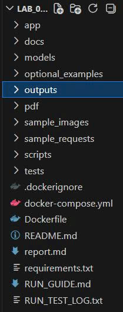

## 3.4 Nhận xét

* Thư mục `app` chứa source code FastAPI.
* Thư mục `models` chứa model phục vụ inference.
* Thư mục `outputs` dùng lưu log.
* Dockerfile dùng để build image.
* docker-compose.yml dùng để triển khai service bằng Docker Compose.

---

# 4. Chạy hệ thống Local

## 4.1 Tạo môi trường Python

### Lệnh thực hiện

```bash
python -m venv .venv
source .venv/bin/activate
pip install -r requirements.txt
```

### Kết quả

```bash
python -c "import fastapi, onnxruntime, PIL; print('IMPORT_OK')"
```

```text
IMPORT_OK
```

### Minh chứng

> Chèn ảnh terminal cài đặt thành công

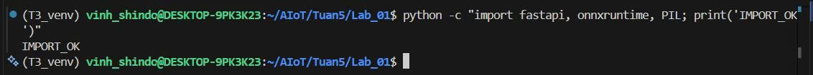

### Nhận xét

Tất cả thư viện cần thiết đã được cài đặt thành công và có thể import bình thường.

---

## 4.2 Tải Vision Model

### Lệnh thực hiện

```bash
python scripts/download_vision_model.py
```

### Kết quả

```text
models/vision/squeezenet1.1-7.onnx
models/vision/imagenet_classes.txt
```

### Minh chứng

> Chèn ảnh thư mục models/vision

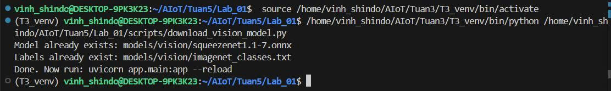

### Nhận xét

Model ONNX và file class mapping đã được tải thành công.

---

## 4.3 Chạy FastAPI Local

### Lệnh thực hiện

```bash
uvicorn app.main:app --reload
```

### Endpoint kiểm tra

```text
http://127.0.0.1:8000/health
```

### Kết quả

```json
{
  "service_status": "ok",
  "vision_model_loaded": true
}
```

### Minh chứng

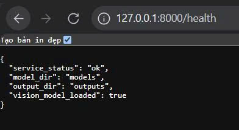

### Nhận xét

* FastAPI hoạt động bình thường.
* Vision model được load thành công.

---

# 5. Kiểm thử API dữ liệu cảm biến

---

## 5.1 Endpoint Forecast

### Lệnh thực hiện

```bash
curl -X POST http://127.0.0.1:8000/forecast \
-H "Content-Type: application/json" \
-d @sample_requests/forecast_request.json
```

### Kết quả

```json
{
  "predicted_value": "...",
  "risk_level": "...",
  "recommendation": "..."
}
```

### Minh chứng

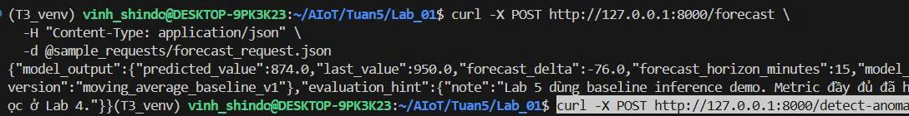

### Nhận xét

* API trả về giá trị dự đoán.
* Có đánh giá mức độ rủi ro.
* Có khuyến nghị cho người vận hành.

---

## 5.2 Endpoint Detect Anomaly

### Lệnh thực hiện

```bash
curl -X POST http://127.0.0.1:8000/detect-anomaly \
-H "Content-Type: application/json" \
-d @sample_requests/detect_anomaly_request.json
```

### Kết quả

```json
{
  "anomaly_score": "...",
  "severity": "..."
}
```

### Minh chứng

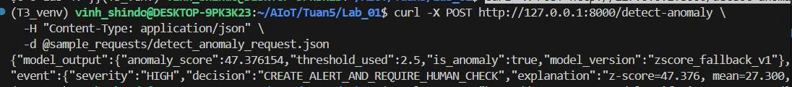

### Nhận xét

Hệ thống phát hiện bất thường dựa trên dữ liệu telemetry đầu vào.

---

# 6. Kiểm thử Vision Inference

---

## 6.1 Giao diện Web

### Endpoint

```text
http://127.0.0.1:8000/classify-image-demo
```

### Minh chứng

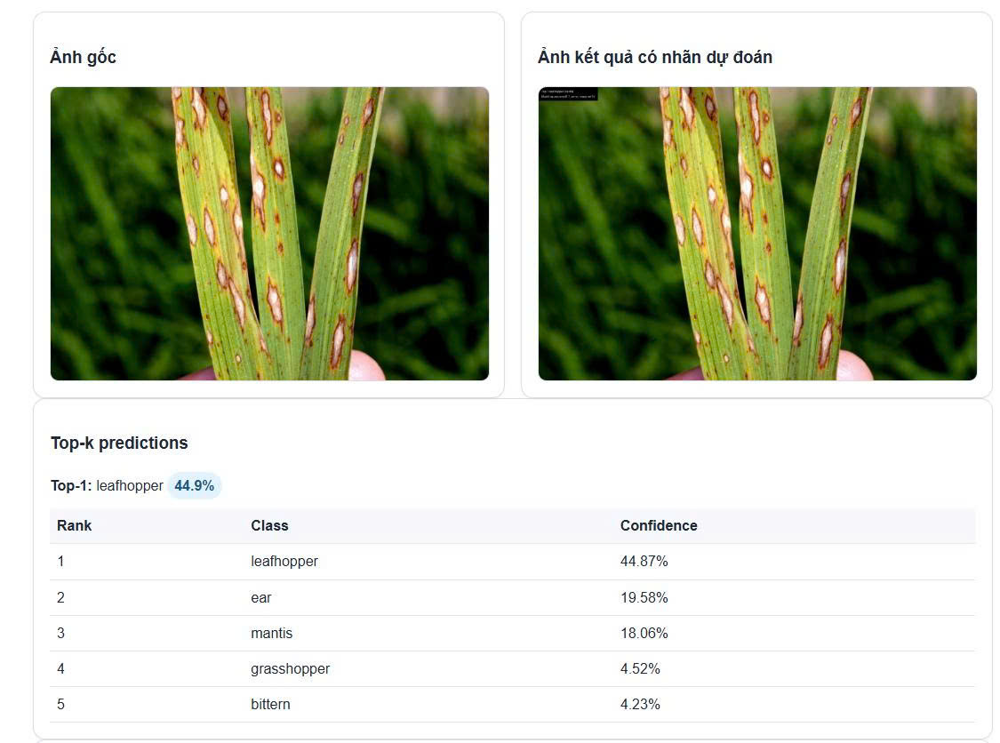
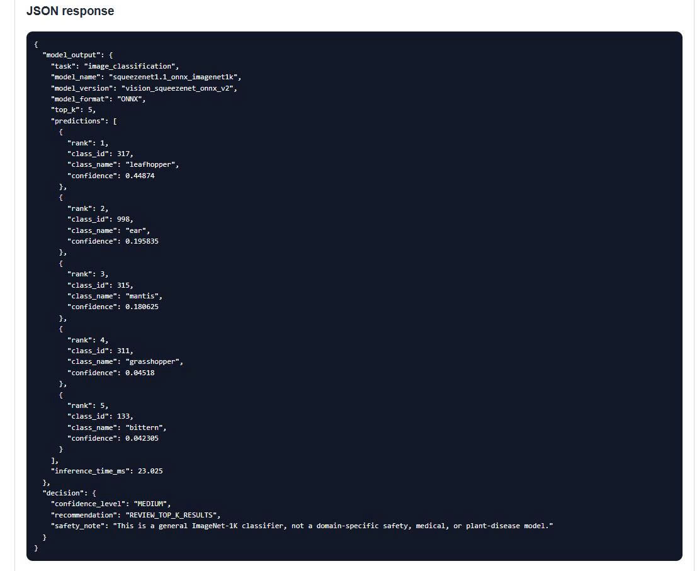

### Kết quả quan sát

* Hiển thị ảnh gốc.
* Hiển thị ảnh kết quả.
* Hiển thị top-k prediction.
* Hiển thị confidence score.

### Nhận xét

Vision Model thực hiện phân loại ảnh thành công.

---

## 6.2 Gọi API bằng Curl

### Lệnh thực hiện

```bash
curl -X POST \
"http://127.0.0.1:8000/classify-image?top_k=5" \
-F "file=@sample_images/classroom_object.jpg;type=image/jpeg"
```

### Kết quả

```json
{
  "predictions": [...],
  "inference_time_ms": ...
}
```

### Minh chứng

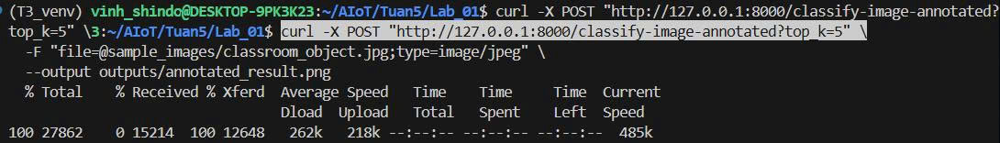

### Nhận xét

Backend API hoạt động độc lập với giao diện web.

---

# 7. Build Docker Image

## 7.1 Lệnh Build

```bash
docker build -t lab5-aiot-inference:v4 .
```

## 7.2 Kiểm tra Image

```bash
docker images
```

### Kết quả

```text
lab5-aiot-inference    v4
```

### Nhận xét

Docker image được build thành công.

---

# 8. Chạy Docker Container

## 8.1 Docker Desktop

### Minh chứng Image

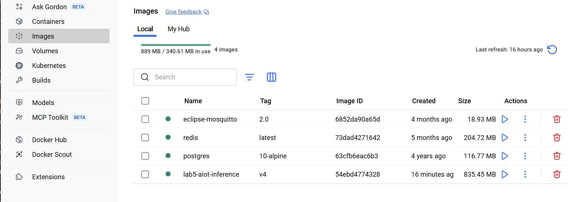

### Minh chứng Container Running

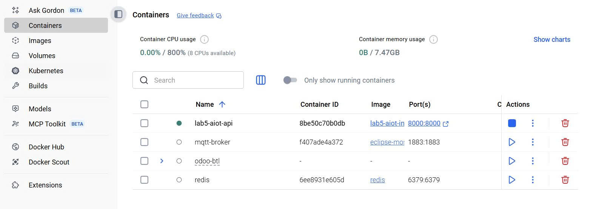

### Minh chứng Logs

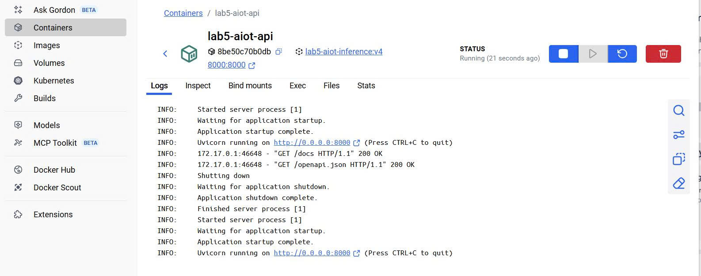

### Nhận xét

Container hoạt động ổn định và có thể quan sát log trực tiếp từ Docker Desktop.

---

## 8.2 Kiểm tra Swagger

### Endpoint

```text
http://127.0.0.1:8000/docs
```

### Minh chứng

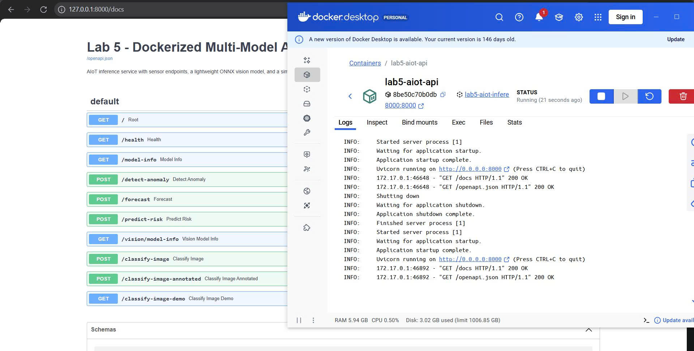

### Nhận xét

Swagger UI hoạt động bình thường trong container.

---

## 8.3 Kiểm thử Vision Demo trong Container

### Minh chứng

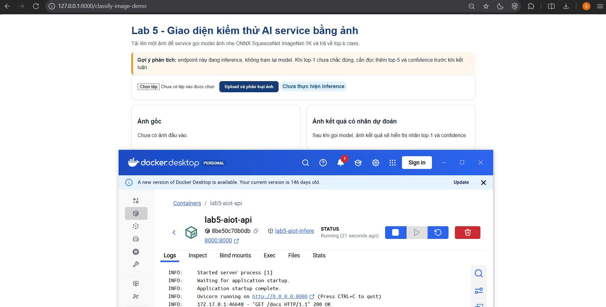

### Nhận xét

Kết quả inference tương đương môi trường Local.

---

# 9. Docker Compose

## 9.1 Chạy hệ thống

```bash
docker compose up --build
```

## 9.2 Dừng hệ thống

```bash
docker compose down
```

### Nhận xét

Docker Compose giúp triển khai hệ thống đơn giản và dễ quản lý hơn so với docker run.

---

# 10. Kiểm tra Log

## Service Log

### Minh chứng

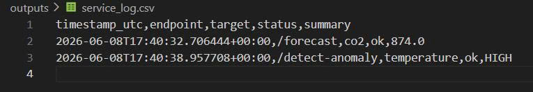

### Nội dung mẫu

```csv
timestamp,endpoint,status,...
```

---

## Vision Inference Log

### Minh chứng

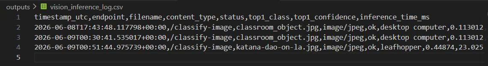

### Nội dung mẫu

```csv
timestamp,class_name,confidence,...
```

---

# 11. So sánh Local và Docker

## 11.1 Local

| Tiêu chí quan sát | Kết quả ghi nhận |
| :--- | :--- |
| **Python version** | **3.12** |
| **Lỗi cài thư viện nếu có** | Không có lỗi khi cài đặt từ file `requirements.txt` trong môi trường ảo (`venv`). |
| **Có load được vision model không** | **Có**, sau khi chạy script tải model, `vision_model_loaded` sẽ trả về `true`. |
| **API /health có chạy không** | **Có**, trả về kết quả `service_status: ok`. |
| **Upload ảnh có thành công không** | **Có**, trả về kết quả dự đoán top-k và ảnh đã được gắn nhãn (annotated). |
| **Log ghi ở đâu** | Tại thư mục **`outputs/`** trên máy host (các file `service_log.csv` và `vision_inference_log.csv`). |

---

## 11.2 Docker

| Tiêu chí quan sát | Kết quả ghi nhận |
| :--- | :--- |
| **Image name/tag** | **`lab5-aiot-inference:v4`**. |
| **Container name** | **`lab5-aiot-api`**. |
| **Port mapping** | **`8000:8000`** (Host port 8000 ánh xạ vào Container port 8000). |
| **Volume mapping** | `outputs` -> `/app/outputs` và `models/vision` -> `/app/models/vision`. |
| **API /health có chạy không** | **Có**, truy cập bình thường qua trình duyệt tại địa chỉ host. |
| **Upload ảnh thành công không** | **Có**, hoạt động ổn định và cho kết quả giống như khi chạy local. |
| **Log có ghi ra host không** | **Có**, nhờ vào cơ chế **Volume mapping** đã thiết lập. |

---

### Kết luận rút ra:
*   **Docker giúp kiểm soát môi trường chạy:** Đóng gói toàn bộ runtime và thư viện, đảm bảo tính nhất quán khi di chuyển giữa các máy.
*   **Docker không thay thế kiểm thử code:** Cần chạy local trước để đảm bảo logic và model hoạt động đúng trước khi đóng gói.
*   **Docker chỉ có giá trị khi cấu hình rõ ràng:** Các yếu tố như image tag, model path, volume mapping và port mapping cần được thiết lập chính xác để service vận hành thực tế.

---

# 12. Trả lời câu hỏi phân tích

## Câu 1

### Nếu thiếu thư mục models/vision thì endpoint ảnh có hoạt động không?

**Trả lời:**

Không. Endpoint phân loại ảnh phụ thuộc trực tiếp vào file model ONNX trong thư mục models/vision. Nếu model không tồn tại, quá trình load model thất bại và endpoint classify-image sẽ không thể thực hiện inference.

---

## Câu 2

### Nếu thiếu thư mục outputs thì container có ghi log ra host được không?

**Trả lời:**

Không. Nếu volume outputs không tồn tại hoặc không được mount đúng, log chỉ tồn tại bên trong container và sẽ mất khi container bị xoá.

---

## Câu 3

### Nếu model weights không có trong project thì container có tự suy luận được không?

**Trả lời:**

Không. AI model cần có trọng số (weights) để thực hiện inference. Thiếu weights đồng nghĩa model không thể load.

---

## Câu 4

### Nếu lớp học không có Internet thì cần chuẩn bị gì?

**Trả lời:**

Cần tải sẵn:

* File ONNX model
* File class mapping
* Docker image (nếu cần)
* Python packages hoặc Docker cache

để có thể chạy offline.

---

## Câu 5

### Vì sao API trả top-5 thay vì top-1?

**Trả lời:**

Top-5 cung cấp nhiều khả năng dự đoán nhất của model, giúp đánh giá độ chắc chắn của inference và hỗ trợ người dùng kiểm tra tính hợp lý của kết quả.

---

## Câu 6

### Nếu confidence cao nhất chỉ khoảng 0.25 thì có nên tự động ra quyết định?

**Trả lời:**

Không nên. Confidence thấp cho thấy model không chắc chắn về dự đoán. Trong hệ thống thực tế cần yêu cầu con người xác nhận hoặc sử dụng thêm nguồn dữ liệu khác.

---

## Câu 7

### Vì sao ImageNet classifier không thay thế được model chuyên ngành?

**Trả lời:**

ImageNet được huấn luyện trên dữ liệu tổng quát. Các bài toán chuyên ngành như y tế, nông nghiệp hoặc công nghiệp cần dữ liệu đặc thù và model được huấn luyện riêng cho miền ứng dụng đó.

---

## Câu 8

### Nếu sửa code trong app/ có cần build lại image không?

**Trả lời:**

Có. Source code đã được đóng gói trong image nên cần build lại image để cập nhật thay đổi.

---

## Câu 9

### Nếu model được mount bằng volume thì có cần build lại image khi đổi model không?

**Trả lời:**

Không. Khi model được mount từ host vào container bằng volume, chỉ cần thay model trên host và khởi động lại service nếu cần.

---

## Câu 10. Sơ đồ đường đi của model
Trong hệ thống thực tế, mô hình không bắt đầu từ định dạng triển khai mà trải qua các giai đoạn sau:
1.  **Dữ liệu huấn luyện:** Thu thập và tiền xử lý dữ liệu.
2.  **Model gốc (Framework):** Huấn luyện trên các framework như PyTorch (.pth), TensorFlow (.h5), hoặc scikit-learn (.pkl).
3.  **Định dạng triển khai (Convert):** Chuyển đổi sang các định dạng tối ưu cho inference như **ONNX**, TFLite hoặc Quantized model để chạy nhẹ hơn và giảm phụ thuộc vào framework gốc.
4.  **API (Serve):** Đóng gói mô hình vào một service (ví dụ FastAPI) để nhận input qua các endpoint và trả về kết quả JSON hoặc ảnh.
5.  **Docker (Containerize):** Đóng gói toàn bộ runtime, thư viện và API vào **Docker Image** để tạo thành một gói triển khai độc lập, sẵn sàng chạy dưới dạng **Container**.

---

## Câu 11. Nhận xét về lợi ích và giới hạn của Docker
**Lợi ích:**
*   **Kiểm soát môi trường:** Đảm bảo tính nhất quán, "chạy được trên máy tôi thì cũng chạy được trên máy khách" nhờ đóng gói sẵn mọi thư viện và runtime.
*   **Tiêu chuẩn triển khai chuyên nghiệp:** Phù hợp với quy trình doanh nghiệp, dễ dàng chia sẻ, quản lý phiên bản qua Image Tag và tích hợp vào CI/CD.
*   **Dễ dàng mở rộng:** Thông qua Docker Compose, có thể quản lý nhiều service cùng lúc (API, database, dashboard) một cách đơn giản.

**Giới hạn:**
*   **Không thay thế kiểm thử code:** Nếu mã nguồn hoặc logic mô hình có lỗi ở local, Docker chỉ đóng gói cái lỗi đó lại chứ không sửa được.
*   **Độ phức tạp khi debug:** Việc tìm lỗi có thể khó hơn vì phải thông qua container logs và cần cấu hình đúng các tham số như port, volume, đường dẫn.

---

## Câu 12. Nhận xét về giới hạn của model ảnh ImageNet general classifier
*   **Tính tổng quát:** SqueezeNet ImageNet-1K chỉ là model phân loại vật thể phổ biến (1000 class), không thể nhận diện được mọi thứ trong đời sống.
*   **Không chuyên sâu:** Model này không thay thế được các mô hình chuyên ngành (như nhận diện bệnh lá cây, lỗi sản phẩm công nghiệp).
*   **Độ tin cậy:** Kết quả cần được xem xét cùng với chỉ số **confidence**; nếu độ tin cậy thấp, không nên dùng để ra quyết định tự động.

---

## Câu 13. Câu hỏi kiểm tra

1.  **Vì sao cần chạy local trước khi build Docker image?**
    Để kiểm tra mã nguồn, thư viện và mô hình đã hoạt động đúng chưa. Nếu chạy local lỗi, việc debug trong Docker sẽ khó khăn và phức tạp hơn rất nhiều.
2.  **Image khác container ở điểm nào?**
    **Image** là một gói tĩnh chứa code và môi trường (giống bản thiết kế), còn **container** là một thực thể đang chạy (instance) được khởi tạo từ image đó.
3.  **Docker Desktop khác Docker Engine trên Ubuntu server ở điểm nào?**
    **Docker Desktop** là ứng dụng có giao diện GUI chạy trên Windows/Mac (dùng VM/WSL backend), phù hợp để học tập và dev. **Docker Engine** chạy trực tiếp trên Linux server, không có GUI, phù hợp cho triển khai thực tế và doanh nghiệp.
4.  **Vì sao cần volume khi ghi log?**
    Để dữ liệu log sinh ra trong container không bị mất khi container bị xóa và giúp máy host có thể truy cập, lưu trữ các file log này trực tiếp.
5.  **Vì sao cần map port `8000:8000`?**
    Để ánh xạ cổng của máy host vào cổng tương ứng của container, cho phép trình duyệt bên ngoài truy cập được vào API đang chạy bên trong container.
6.  **Pretrained model khác model tự train ở điểm nào?**
    **Pretrained model** là mô hình đã được huấn luyện sẵn trên tập dữ liệu lớn (như ImageNet) và có thể dùng ngay. **Model tự train** là mô hình do người dùng huấn luyện từ đầu trên tập dữ liệu cụ thể của họ.
7.  **ONNX giải quyết vấn đề gì khi triển khai model?**
    Giúp mô hình có thể trao đổi giữa các framework khác nhau, hỗ trợ inference nhẹ (qua ONNX Runtime) và giảm sự phụ thuộc vào framework huấn luyện ban đầu.
8.  **Nếu model ảnh chưa được tải, endpoint `/classify-image` sẽ gặp vấn đề gì?**
    Endpoint này sẽ không thể thực hiện inference; khi kiểm tra `/health`, trạng thái `vision_model_loaded` sẽ là `false`.
9.  **Nếu Docker chạy được nhưng trình duyệt không mở API được, cần kiểm tra những điểm nào?**
    Cần kiểm tra xem container có thực sự đang ở trạng thái **Running** không, cấu hình **port mapping** có đúng không, và xem log của container có báo lỗi server không.
10. **Trong doanh nghiệp, vì sao cần model version và image tag?**
    Để quản lý phiên bản triển khai, biết chính xác service đang dùng mô hình nào và cho phép **rollback** (quay lại phiên bản cũ) nhanh chóng nếu phiên bản mới gặp lỗi.

---

# 13. Kết luận

Qua bài lab, em đã:

* Xây dựng AI Inference Service bằng FastAPI.
* Thực hiện inference cho dữ liệu cảm biến và dữ liệu ảnh.
* Đóng gói hệ thống bằng Docker.
* Triển khai bằng Docker Desktop, Docker CLI và Docker Compose.
* Hiểu được vai trò của image, container, volume, port mapping và logging trong triển khai hệ thống AI thực tế.
* So sánh được sự khác biệt giữa môi trường Local và Docker.

Kết quả cho thấy Docker giúp chuẩn hóa môi trường triển khai, tăng khả năng tái sử dụng và giảm lỗi do khác biệt cấu hình giữa các máy.