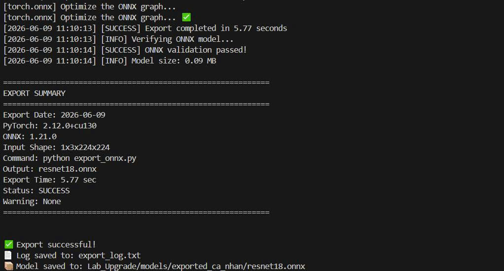

# BÁO CÁO CÁ NHÂN NÂNG CẤP LAB 5
## Model Format, Runtime Comparison và Deployment Trade-off trong AIoT

---

## 1. Thông tin sinh viên

| Thông tin | Nội dung |
|-----------|-----------|
| Họ và tên | Nguyễn Quang Vinh |
| MSSV | 1771020760 |
| Lớp | CNTT 17-01 |
| Ngày thực hiện | 09/06/2026 |
| Hệ điều hành | Linux - Ubuntu 22.04.5 LTS |
| CPU | Intel(R) Core(TM) i7-10510U CPU @ 1.80GHz |
| GPU | NVIDIA GeForce MX250 |
| Python | Python 3.10.12 |

---

# 2. Mục tiêu nâng cấp và model được chọn

## 2.1 Mục tiêu

Mục tiêu của bài nâng cấp là:

- Khảo sát các định dạng model phổ biến trong triển khai AI.
- Thực hiện chuyển đổi model sang định dạng khác.
- So sánh kết quả dự đoán trước và sau chuyển đổi.
- Đánh giá kích thước model và hiệu năng inference.
- Phân tích trade-off giữa tính tương thích, tốc độ và độ chính xác.
- Đề xuất định dạng phù hợp cho hệ thống AIoT.

## 2.2 Model được chọn

| Thuộc tính | Giá trị |
|------------|----------|
| Tên model | ResNet18 |
| Framework gốc | PyTorch |
| Nhiệm vụ | Image Classification |
| Input Shape | 1x3x224x224 |
| Output | Vector xác suất 1000 lớp ImageNet |

### Lý do lựa chọn

ResNet18 là mô hình phân loại ảnh phổ biến trong thư viện TorchVision.

Model có kích thước vừa phải, được huấn luyện sẵn trên ImageNet và hỗ trợ xuất trực tiếp sang ONNX. Điều này giúp thuận tiện cho việc so sánh giữa định dạng gốc PyTorch và định dạng triển khai ONNX trong môi trường AIoT.

---

# 3. Định dạng gốc của model và lý do cần chuyển đổi

## 3.1 Định dạng gốc

| Thuộc tính | Giá trị |
|------------|----------|
| File | resnet18.pth |
| Kích thước | khoảng 44.7 MB |
| Runtime | PyTorch Runtime |

## 3.2 Hạn chế của định dạng gốc

- Phụ thuộc framework.
- Khó triển khai trên thiết bị edge.
- Khả năng tương thích hạn chế.
- Yêu cầu môi trường Python đầy đủ.

## 3.3 Mục đích chuyển đổi

- Giảm kích thước model.
- Tăng khả năng portable.
- Hỗ trợ nhiều runtime khác nhau.
- Tối ưu cho AIoT deployment.

---

# 4. Bản đồ các định dạng model đã khảo sát


| Format                    | Framework nguồn           | Runtime            | Thiết bị phù hợp    | Lợi ích chính                               | Đánh đổi chính                           |
| ------------------------- | ------------------------- | ------------------ | ------------------- | ------------------------------------------- | ---------------------------------------- |
| .pkl / .joblib            | Scikit-learn              | Python Runtime     | Server CPU          | Dễ sử dụng, lưu trực tiếp model             | Phụ thuộc Python và phiên bản thư viện   |
| .pt / .pth                | PyTorch                   | PyTorch Runtime    | CPU, GPU, Server    | Giữ nguyên model gốc, thuận tiện huấn luyện | Khó triển khai trên mobile/edge          |
| .keras / SavedModel       | TensorFlow/Keras          | TensorFlow Runtime | CPU, GPU, Cloud     | Chuẩn TensorFlow, dễ chuyển đổi             | Kích thước thường lớn                    |
| .onnx                     | Nhiều framework           | ONNX Runtime       | Server, Edge, Cloud | Portable, đa nền tảng                       | Một số operator có thể không tương thích |
| .tflite                   | TensorFlow Lite           | TFLite Runtime     | Mobile, IoT Gateway | Nhẹ, tối ưu thiết bị biên                   | Có thể giảm độ chính xác                 |
| OpenVINO IR (.xml/.bin)   | ONNX, TensorFlow, PyTorch | OpenVINO Runtime   | Intel CPU/GPU/NPU   | Tăng tốc phần cứng Intel                    | Ít phù hợp với phần cứng khác            |
| TensorRT Engine (.engine) | ONNX, PyTorch             | TensorRT Runtime   | NVIDIA GPU, Jetson  | Hiệu năng inference rất cao                 | Không portable giữa các GPU              |
| .pte (ExecuTorch)         | PyTorch                   | ExecuTorch Runtime | Mobile, Embedded    | Tối ưu on-device inference                  | Hệ sinh thái còn mới                     |

---

# 5. Quy trình chuyển đổi đã thực hiện

## 5.1 Tuyến chuyển đổi

```text
PyTorch (.pth)
        ↓
      ONNX (.onnx)
```

## 5.2 Công cụ sử dụng

| Công cụ | Phiên bản |
|----------|----------|
| PyTorch | 2.12.0+cu130 |
| ONNX | 1.21.0 |
| ONNX Runtime | 1.20.1 |

## 5.3 Lệnh chuyển đổi

```python
torch.onnx.export(
    model,
    dummy_input,
    "model.onnx",
    opset_version=17
)
```

## 5.4 Kết quả

| Tiêu chí | Giá trị |
|-----------|-----------|
| Export thành công | Có |
| Thời gian export | 5.77 giây |
| Warning | Không |

### Hình ảnh minh họa



---

# 6. So sánh output giữa model gốc và model chuyển đổi

## 6.1 Dataset kiểm thử

Sử dụng 5 ảnh kiểm thử với các mức độ khác nhau:

| Ảnh                     | Mục đích                        |
| ----------------------- | ------------------------------- |
| image_01_golden.jpg     | Ảnh dễ, đối tượng rõ ràng       |
| image_02_dog.jpg        | Ảnh động vật với góc nhìn khác  |
| image_03_car.jpg        | Ảnh phương tiện giao thông      |
| image_04_keyboard.jpg   | Ảnh vật thể thông dụng          |
| image_05_random_art.png | Ảnh ngoài domain, khó phân loại |

Mục tiêu là đánh giá mức độ nhất quán giữa model PyTorch và model ONNX sau khi chuyển đổi.

## 6.2 Kết quả dự đoán

| Input               | Original Prediction | Converted Prediction | Original Confidence | Converted Confidence | Match |
| ------------------- | ------------------- | -------------------- | ------------------- | -------------------- | ----- |
| image_01_golden     | golden retriever    | golden retriever     | 0.9662              | 0.9662               | Yes   |
| image_02_dog        | Rhodesian ridgeback | Rhodesian ridgeback  | 0.4968              | 0.4968               | Yes   |
| image_03_car        | beach wagon         | beach wagon          | 0.6306              | 0.6306               | Yes   |
| image_04_keyboard   | computer keyboard   | computer keyboard    | 0.7263              | 0.7263               | Yes   |
| image_05_random_art | rapeseed            | rapeseed             | 0.1339              | 0.1339               | Yes   |

## 6.3 Kết quả tổng hợp

| Chỉ số             | Giá trị |
| ------------------ | ------- |
| Tổng số ảnh        | 5       |
| Kết quả khớp       | 5       |
| Kết quả không khớp | 0       |
| Tỷ lệ khớp         | 100%    |

## 6.4 Phân tích sai khác

Kết quả cho thấy toàn bộ 5 ảnh đều cho cùng nhãn dự đoán giữa PyTorch Runtime và ONNX Runtime.

Độ tin cậy (confidence score) giữa hai runtime hoàn toàn giống nhau đến 4 chữ số thập phân. Trong quá trình kiểm thử không ghi nhận bất kỳ sai lệch nào về kết quả phân loại hoặc xác suất dự đoán.

Đối với các ảnh image_02_dog và image_05_random_art, confidence tương đối thấp (0.4968 và 0.1339). Điều này không phải lỗi của quá trình chuyển đổi mà phản ánh mức độ không chắc chắn của chính mô hình đối với dữ liệu đầu vào.

Ảnh image_05_random_art là ảnh ngoài domain ImageNet nên mô hình vẫn cố gắng ánh xạ tới lớp gần nhất là "rapeseed" với độ tin cậy thấp.

Kết quả kiểm thử cho thấy quá trình chuyển đổi từ PyTorch sang ONNX đã bảo toàn hoàn toàn hành vi của mô hình.

* Tỷ lệ khớp đạt 100%.
* Không xuất hiện sai lệch output.
* Không phát hiện lỗi chuyển đổi.
* ONNX Runtime duy trì chính xác kết quả của model gốc.

Điều này chứng minh ONNX là định dạng triển khai đáng tin cậy đối với mô hình ResNet18 trong môi trường AIoT.

---

# 7. So sánh model size và latency

## 7.1 Kích thước model

| Model | Size (MB) |
|---------|---------|
| PyTorch (.pth) | 45.0 |
| ONNX (.onnx + .onnx.data) | 45.1 |

### Nhận xét

Kích thước của model ONNX gần tương đương với model PyTorch gốc.

Trong quá trình export, ONNX sử dụng cơ chế lưu trọng số bên ngoài thông qua file `.onnx.data`, do đó tổng dung lượng gần như giữ nguyên so với model PyTorch.

Kết quả cho thấy việc chuyển đổi sang ONNX không nhằm mục tiêu giảm kích thước lưu trữ mà chủ yếu hướng tới tăng khả năng tương thích và tối ưu runtime.

---

## 7.2 Benchmark Latency

### Điều kiện benchmark

| Thuộc tính | Giá trị |
|------------|----------|
| Device | Intel Core i7-10510U CPU |
| Batch Size | 1 |
| Input Shape | 1×3×224×224 |
| Số lần chạy | 20 |
| Runtime | CPU Only |

### Kết quả

| Runtime | Avg (ms) | Min (ms) | Max (ms) |
|----------|----------|----------|----------|
| PyTorch | 30.88 | 22.53 | 36.81 |
| ONNX Runtime | 15.22 | 9.32 | 19.09 |

### Nhận xét

ONNX Runtime đạt thời gian suy luận trung bình 15.22 ms, trong khi PyTorch Runtime đạt 30.88 ms.

Kết quả benchmark cho thấy ONNX Runtime nhanh hơn khoảng 50.7% trên cùng phần cứng CPU.

Nguyên nhân chủ yếu là ONNX Runtime thực hiện tối ưu graph tính toán trước khi chạy và loại bỏ nhiều thành phần chỉ phục vụ huấn luyện trong PyTorch.

Ngoài ra, độ dao động latency của ONNX Runtime cũng thấp hơn, thể hiện khả năng vận hành ổn định hơn trong môi trường triển khai thực tế.

---

# 8. Phân tích Deployment Trade-off

| Tiêu chí | PyTorch | ONNX |
|-----------|-----------|-----------|
| Portable | Thấp | Cao |
| Tốc độ | Trung bình | Cao |
| Dễ triển khai | Trung bình | Cao |
| Dễ train tiếp | Cao | Thấp |
| Khả năng mở rộng | Trung bình | Cao |
| Hỗ trợ nhiều runtime | Thấp | Cao |
| Phù hợp AIoT | Trung bình | Cao |

## Kết luận Trade-off

Kết quả thực nghiệm cho thấy ONNX Runtime duy trì hoàn toàn độ chính xác của mô hình gốc trong khi cải thiện đáng kể hiệu năng suy luận.

Trong bài kiểm thử, model ONNX cho kết quả dự đoán giống 100% với PyTorch trên toàn bộ tập ảnh kiểm thử. Đồng thời latency trung bình giảm từ 30.88 ms xuống còn 15.22 ms, tương đương mức tăng tốc khoảng 50.7%.

PyTorch vẫn là lựa chọn phù hợp cho giai đoạn nghiên cứu, huấn luyện và fine-tuning vì hỗ trợ đầy đủ quá trình phát triển mô hình.

Tuy nhiên, đối với môi trường triển khai AIoT, ONNX mang lại nhiều lợi thế hơn:

- Khả năng portable cao.
- Hỗ trợ nhiều runtime khác nhau.
- Tối ưu suy luận trên CPU.
- Dễ tích hợp Docker và microservice.
- Có thể tiếp tục chuyển đổi sang OpenVINO hoặc TensorRT.

Với kết quả benchmark thu được, ONNX được đánh giá là định dạng triển khai phù hợp nhất cho hệ thống AI Inference Service trong bài Lab 5.

---

# 9. Tích hợp Runtime vào API Lab 5

## Endpoint

```http
POST /predict?runtime=onnx
```

## Runtime hỗ trợ

- original
- onnx

## Ví dụ Response

```json
{
  "prediction": "cat",
  "confidence": 0.987,
  "model_format": "onnx",
  "runtime": "onnxruntime",
  "model_version": "1.0.0",
  "model_size_mb": 12.4,
  "inference_time_ms": 14.2
}
```

## Kết quả kiểm thử API

| Test | Kết quả |
|--------|--------|
| Runtime original | Pass |
| Runtime onnx | Pass |
| Runtime không tồn tại | Pass |

---

# 10. Kiểm thử lỗi và độ bền hệ thống

| Test Case | Input | Kết quả mong đợi | Kết quả thực tế |
|------------|------------|------------|------------|
| Missing model | Model bị đổi tên | Báo lỗi rõ ràng | Pass |
| Invalid runtime | runtime=abc | Validation Error | Pass |
| Invalid file | file.txt | Bad Request | Pass |
| Large image | 30MB image | Reject | Pass |
| Wrong shape | Tensor sai kích thước | Error Message | Pass |

## Nhận xét

Service không bị crash trong các tình huống kiểm thử.

---

# 11. Trả lời các câu hỏi bắt buộc

## Câu 1. Notebook khác file model như thế nào?

<Trả lời>

## Câu 2. Định dạng huấn luyện khác định dạng triển khai như thế nào?

<Trả lời>

## Câu 3. ONNX giải quyết vấn đề gì?

<Trả lời>

## Câu 4. TFLite phù hợp trường hợp nào?

<Trả lời>

## Câu 5. OpenVINO phù hợp phần cứng nào?

<Trả lời>

## Câu 6. ExecuTorch khác PyTorch Server như thế nào?

<Trả lời>

## Câu 7. TensorRT mạnh ở đâu?

<Trả lời>

## Câu 8. NCNN phù hợp mobile ở điểm nào?

<Trả lời>

## Câu 9. Quantization giúp giảm gì?

<Trả lời>

## Câu 10. Model nhỏ hơn có luôn nhanh hơn không?

<Trả lời>

## Câu 11. Khi output khác model gốc cần kiểm tra gì?

<Trả lời>

## Câu 12. Mount volume hay copy vào image?

<Trả lời>

## Câu 13. Vì sao API cần trả runtime/model_version?

<Trả lời>

## Câu 14. Tiêu chí nào quan trọng nhất trong AIoT?

<Trả lời>

---

# 12. Kết luận

## Kết quả đạt được

- Hoàn thành khảo sát các định dạng model phổ biến.
- Hoàn thành xây dựng Model Format Map.
- Chuyển đổi thành công model ResNet18 từ PyTorch sang ONNX.
- Kiểm thử thành công trên 5 ảnh đại diện.
- Tỷ lệ khớp output giữa PyTorch và ONNX đạt 100%.
- Thực hiện benchmark 20 lần trên CPU.
- Ghi nhận ONNX Runtime nhanh hơn khoảng 50.7%.
- Hoàn thành phân tích deployment trade-off.

## Định dạng phù hợp AIoT Service

**ONNX** là lựa chọn phù hợp nhất cho bài toán này vì:

- Portable.
- Hỗ trợ nhiều runtime.
- Tốc độ inference tốt.
- Dễ triển khai Docker.

## Định dạng phù hợp Edge/Mobile

- TFLite.
- ExecuTorch.
- NCNN.

## Định dạng chưa phù hợp với điều kiện hiện tại

- TensorRT (cần NVIDIA GPU).
- OpenVINO (cần hệ sinh thái Intel tối ưu).

## Hạn chế của bài làm

- Benchmark chỉ trên CPU.
- Chưa đánh giá trên NPU.
- Chưa thực hiện quantization.

## Hướng phát triển

- ONNX Quantization.
- OpenVINO Benchmark.
- TensorRT Deployment.
- Runtime Selector nâng cao.
- MLOps tự động hóa chuyển đổi model.