# BÁO CÁO LAB 6 – COMPUTER VISION AS IoT SENSOR

## 1. Thông tin sinh viên

* Họ và tên: Nguyễn Quang Vinh
* Môn học: Triển khai, phát triển ứng dụng AI và IoT
* Lab: Lab 6 – Computer Vision as IoT Sensor
* Ngày thực hiện: 10/06/2026

---

# 2. Mục tiêu bài lab

Trong bài lab này, em thực hiện xây dựng pipeline xử lý ảnh trong hệ thống AIoT bằng cách xem camera như một cảm biến IoT trực quan.

Các chức năng chính gồm:

* Camera stream từ webcam/IP camera hoặc stream mô phỏng
* Chụp snapshot
* Xử lý ảnh qua các bước:

  * Resize
  * Grayscale
  * Threshold
  * Edge Detection
* Ghi metadata ảnh
* Sinh visual event
* Motion capture
* Dashboard quan sát hệ thống

---

# 3. Môi trường thực hiện

## 3.1 Phần cứng

* Laptop có webcam
* Hoặc IP camera (nếu có)

## 3.2 Phần mềm

* Python 3.x
* FastAPI
* OpenCV (cv2)
* Pillow (PIL)
* Uvicorn

## 3.3 Cấu trúc project

lab6_cv_as_iot_sensor/

* app.py
* index.html
* run_lab6_demo.py
* data/

  * raw_images/
  * processed_images/
  * videos/
* outputs/

  * image_metadata.csv
  * image_event_log.csv

---

# 4. Các bước thực hiện

## 4.1 Tạo môi trường và cài thư viện

Lệnh thực hiện:

```bash
python -m venv .venv

# Windows
.venv\Scripts\activate

# Linux/macOS
source .venv/bin/activate

pip install -r requirements.txt
```

Kết quả:

* Không xuất hiện lỗi import
* Cài đặt thành công fastapi, cv2 và PIL

---

## 4.2 Chạy thử pipeline không cần camera

Lệnh thực hiện:

```bash
python run_lab6_demo.py
```

Kết quả quan sát:

* Sinh dữ liệu mẫu
* Có file trong:

  * data/raw_images/
  * data/processed_images/
  * data/videos/
  * outputs/

---

## 4.3 Chạy dashboard

Lệnh thực hiện:

```bash
uvicorn app:app --reload --host 0.0.0.0 --port 8000
```

Mở trình duyệt:

```text
http://127.0.0.1:8000/
```

Kết quả:

* Dashboard hiển thị thành công
* Có giao diện camera stream
* Có các nút snapshot, upload ảnh, motion capture và ghi video
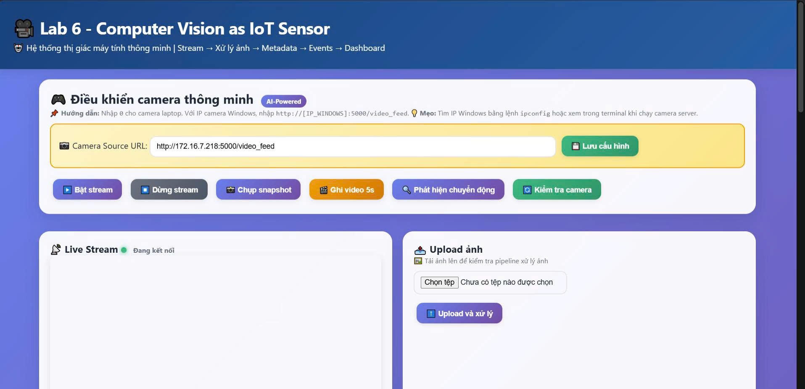
---

# 5. Kết quả thực hiện

## 5.1 Camera Stream

Mô tả:

* Dashboard hiển thị live stream từ webcam hoặc stream mô phỏng.

Kết quả đạt được:

* Stream hoạt động ổn định
* Frame hiển thị liên tục
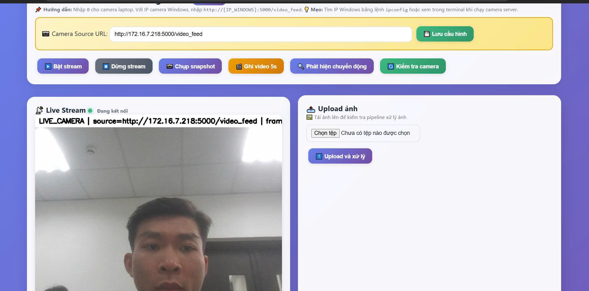
---

## 5.2 Snapshot

Mô tả:

* Chụp ảnh từ camera.

Kết quả:

* Ảnh gốc:

* Ảnh xuất hiện trên dashboard
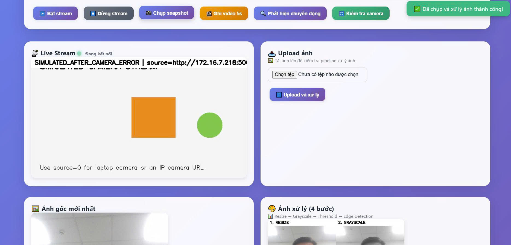
---

## 5.3 Xử lý ảnh

Pipeline xử lý gồm

1. Resize
2. Grayscale
3. Threshold
4. Edge Detection

Kết quả:

* Ảnh xử lý được lưu trong:
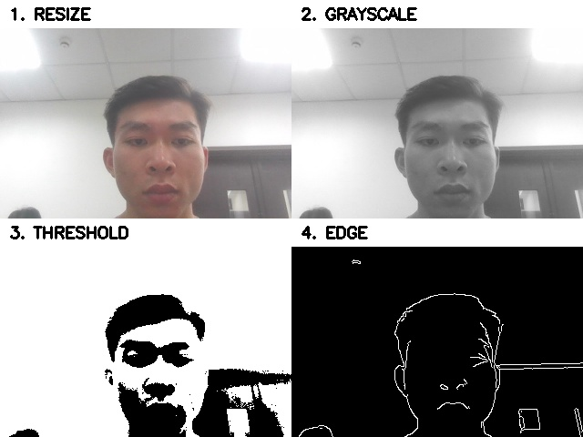
Ý nghĩa:

* Resize giảm kích thước ảnh
* Grayscale chuyển ảnh sang mức xám
* Threshold phân tách vùng sáng/tối
* Edge phát hiện biên vật thể

---

## 5.4 Metadata

File:

```text
outputs/image_metadata.csv
```
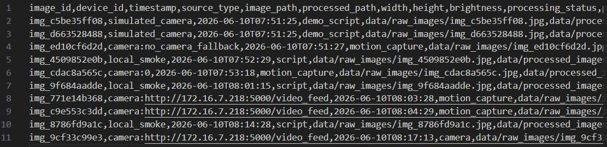
Thông tin metadata gồm:

* Tên ảnh
* Timestamp
* Kích thước ảnh
* Đường dẫn file
* Thông tin xử lý

Vai trò:

Metadata giúp hệ thống quản lý và truy vết dữ liệu ảnh.

---

## 5.5 Event Log

File:

```text
outputs/image_event_log.csv
```
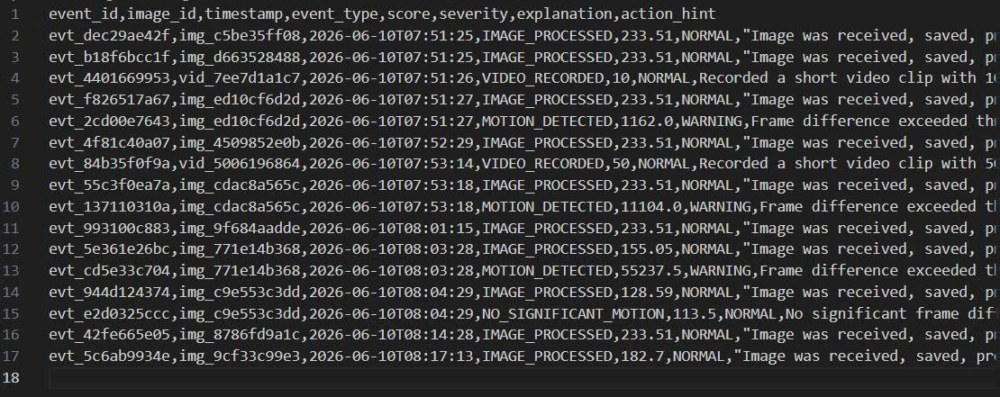
Các event quan sát được:

* SNAPSHOT_CAPTURED
* IMAGE_UPLOADED
* VIDEO_RECORDED
* MOTION_DETECTED
* NO_SIGNIFICANT_MOTION

Vai trò:

Event dùng để mô tả các hành động hoặc sự kiện có ý nghĩa vận hành trong hệ thống AIoT.

---

## 5.6 Motion Capture

Mô tả:

* Hệ thống so sánh frame liên tiếp để phát hiện chuyển động.

Kết quả:

* Khi có thay đổi lớn giữa các frame:

  * Sinh event MOTION_DETECTED
  * Chụp ảnh lưu lại

Nhận xét:

Motion detection chỉ phát hiện sự thay đổi hình ảnh, chưa phải object detection.

---

# 6. Phân tích code

## 6.1 app.py

Vai trò:

* Backend FastAPI
* Xử lý stream camera
* Snapshot
* Video recording
* Motion capture
* Xử lý ảnh
* Ghi metadata và event

Các hàm quan trọng:

### log_image_pipeline()

* Lưu ảnh gốc
* Tạo ảnh xử lý
* Ghi metadata
* Sinh event

### create_processed_contact_sheet()

* Tạo ảnh gồm:

  * Resize
  * Grayscale
  * Threshold
  * Edge

### motion_capture()

* So sánh frame
* Phát hiện chuyển động

---

## 6.2 index.html

Vai trò:

* Dashboard giao diện người dùng
* Hiển thị stream
* Gọi API backend
* Quan sát pipeline ảnh

---

# 7. Trả lời câu hỏi phân tích

## Câu 1

Camera được xem là cảm biến thị giác (visual sensor) vì nó thực hiện nhiệm vụ thu nhận dữ liệu hình ảnh từ môi trường vật lý, tương tự như cách các cảm biến truyền thống thu thập dữ liệu telemetry (nhiệt độ, độ ẩm)
. Trong hệ thống AIoT, camera đóng vai trò là "mắt thần" giúp hệ thống trích xuất thông tin trực quan để đưa ra các quyết định vận hành

## Câu 2

Dữ liệu ảnh có dung lượng lớn, độ phức tạp cao và chứa nhiều ngữ cảnh hơn hẳn telemetry số
. Trong khi telemetry số thường là các giá trị đơn lẻ dễ lưu trữ và xử lý, thì dữ liệu ảnh đòi hỏi một pipeline xử lý phức tạp (tiền xử lý, trích xuất đặc trưng) để hiểu được nội dung bên trong

## Câu 3

Metadata đóng vai trò là "nhãn thông tin" mô tả các thuộc tính của ảnh như: thời gian chụp (timestamp), thiết bị nguồn (device_id), độ phân giải và độ sáng. Điều này giúp hệ thống quản lý, tra cứu và phân loại dữ liệu hiệu quả trong các kho lưu trữ lớn

## Câu 4

Việc chỉ lưu ảnh mà thiếu device_id và timestamp sẽ khiến dữ liệu trở nên vô chủ và mất tính thời điểm, gây khó khăn cho việc truy vết sự kiện khi có sự cố. Metadata đi kèm giúp định vị chính xác ảnh đó thuộc về cảm biến nào và xảy ra vào lúc nào trong dòng thời gian vận hành

## Câu 5

* Resize: giảm kích thước ảnh
* Grayscale: chuyển sang ảnh xám
* Threshold: tách vùng sáng tối
* Edge: phát hiện biên

## Câu 6

Không. Motion capture (phát hiện chuyển động) chỉ dựa trên sự thay đổi cường độ pixel giữa các khung hình (frame difference) để nhận biết có sự xê dịch. Nó chưa thể định danh hoặc phân loại đó là vật thể gì (người, xe, hay con vật) như các mô hình AI Object Detection

## Câu 7

Hệ thống nên sinh event như:

* LOW_LIGHT
* BLUR_IMAGE
* CAMERA_QUALITY_WARNING

## Câu 8

Hệ thống cần có cơ chế Stream mô phỏng (Simulated Stream). Cơ chế dự phòng này giúp pipeline xử lý của hệ thống AIoT không bị ngắt quãng, cho phép tiếp tục kiểm tra các chức năng khác ngay cả khi phần cứng camera gặp lỗi.

## Câu 9

Dashboard cho phép quan sát trực quan và tương tác thời gian thực. Thay vì đọc các dòng text khô khan trong CSV, dashboard hiển thị trực tiếp luồng stream, các bước biến đổi ảnh qua 4 giai đoạn và dòng thời gian (timeline) sự kiện, giúp người vận hành nhận diện lỗi nhanh chóng.

## Câu 10

Lab 6 đóng vai trò xây dựng hạ tầng dữ liệu sạch bao gồm: luồng ảnh đã tiền xử lý, danh sách metadata và nhật ký sự kiện. Đây là nền tảng để Lab 7 tích hợp các mô hình AI (như YOLO) nhằm thực hiện nhận diện vật thể và vẽ bounding box lên các ảnh đã được chuẩn bị này.
---

# 8. Kết luận

Qua bài lab này, em đã hiểu cách tích hợp camera như một cảm biến AIoT trong hệ thống xử lý ảnh. Em đã thực hiện được:

* Stream camera
* Snapshot
* Xử lý ảnh
* Ghi metadata
* Sinh event
* Motion detection
* Dashboard giám sát

Bài lab giúp làm nền tảng cho Object Detection ở Lab 7.

---

# 9. PHẦN NÂNG CẤP (UPGRADE) – PARAMETER EXPERIMENT

## 9.1 Mục tiêu nâng cấp

Sau khi hoàn thành phiên bản cơ bản của Lab 6, hệ thống tiếp tục được nâng cấp nhằm nghiên cứu sâu hơn về ảnh hưởng của các tham số xử lý ảnh đến chất lượng visual event trong hệ thống AIoT.

Phiên bản nâng cấp tập trung vào:

* ROI (Region of Interest)
* Threshold ảnh xám
* Canny Edge Detection
* Motion Score
* Brightness Score
* Blur Score
* Cooldown Event
* Parameter Experiment Logging

Mục tiêu chính là đánh giá mức độ ảnh hưởng của từng tham số đến:

* Chất lượng ảnh xử lý
* Độ chính xác event
* Độ tin cậy của pipeline AIoT

---

# 9.2 Pipeline nâng cấp

Pipeline xử lý ảnh nâng cao:

```text id="0l9m4w"
Camera/Image
→ ROI
→ Resize/Grayscale
→ Threshold/Edge
→ Brightness Score
→ Blur Score
→ Motion Score
→ Event Rule
→ Metadata Log
→ Event Log
→ Parameter Experiment Log
→ Dashboard
```

Ý nghĩa:

* ROI giúp tập trung xử lý vùng quan trọng
* Threshold điều khiển phân tách sáng/tối
* Edge giúp phát hiện cấu trúc ảnh
* Brightness và Blur đánh giá chất lượng ảnh
* Motion score hỗ trợ phát hiện chuyển động
* Parameter log giúp truy vết cấu hình xử lý

---

# 9.3 Các chức năng nâng cấp đã thực hiện

## 9.3.1 ROI (Region of Interest)

Hệ thống được nâng cấp thêm khả năng chọn vùng giám sát ROI thay vì xử lý toàn bộ frame.

Kết quả:

* Giảm nhiễu nền
* Giảm chi phí tính toán
* Tăng độ chính xác event

Ảnh minh chứng:

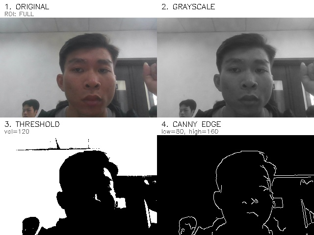 
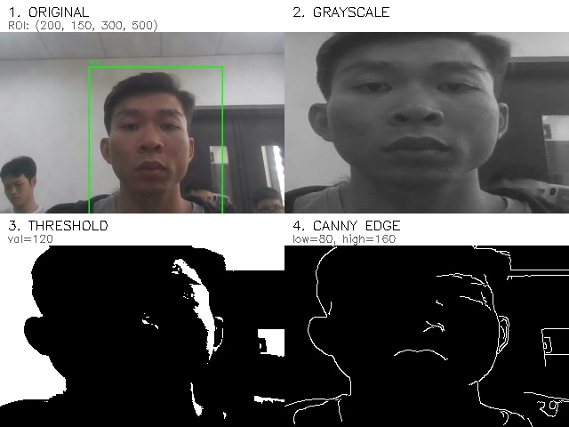

Nhận xét:

ROI sai vị trí có thể làm hệ thống bỏ sót chuyển động quan trọng.

---

## 9.3.2 Brightness Score

Độ sáng kém sẽ không nhận diện được

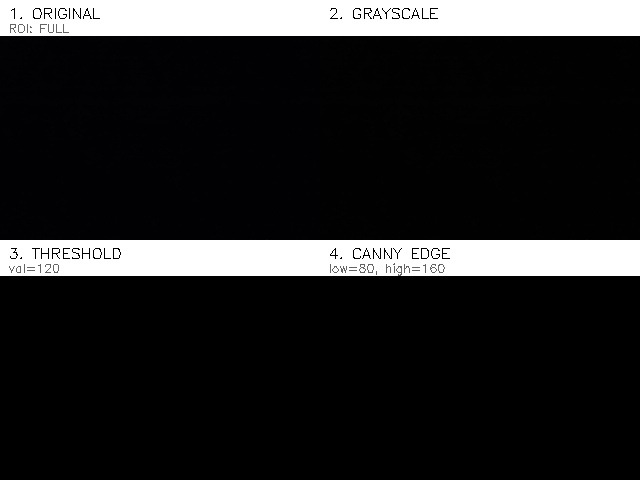

Hệ thống bổ sung hàm:

```python id="u8ck9d"
compute_brightness()
```

Vai trò:

* Tính độ sáng trung bình của ảnh
* Đánh giá chất lượng nguồn camera

Các event mới:

* LOW_LIGHT
* IMAGE_QUALITY_OK

Nhận xét:

Ảnh quá tối sẽ ảnh hưởng trực tiếp đến chất lượng object detection ở Lab 7.

---

## 9.3.3 Blur Score

Hệ thống bổ sung:

```python id="k1dh9z"
compute_blur_score()
```

Vai trò:

* Đánh giá độ sắc nét bằng variance của Laplacian

Các event mới:

* BLURRY_IMAGE

Nhận xét:

Camera rung hoặc mất nét làm giảm blur score đáng kể.

---

# 9.4 Thử nghiệm tham số Threshold

## Tham số thử nghiệm

* Threshold = 80
* Threshold = 120
* Threshold = 180

## Kết quả quan sát

| Threshold | Kết quả                           |
| --------- | --------------------------------- |
| 80        | Ảnh sáng mạnh, nhiều chi tiết nền |
| 120       | Cân bằng giữa chi tiết và nhiễu   |
| 180       | Mất nhiều chi tiết vùng tối       |

## Nhận xét

Threshold quá cao làm mất chi tiết vật thể, trong khi threshold quá thấp làm tăng nhiễu ảnh.

Ảnh minh chứng:

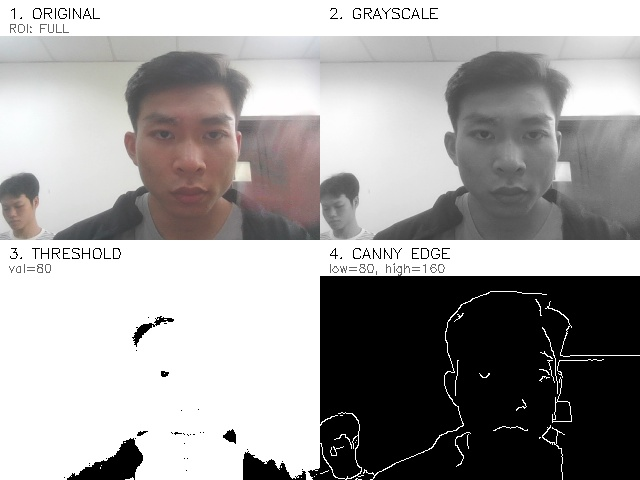 
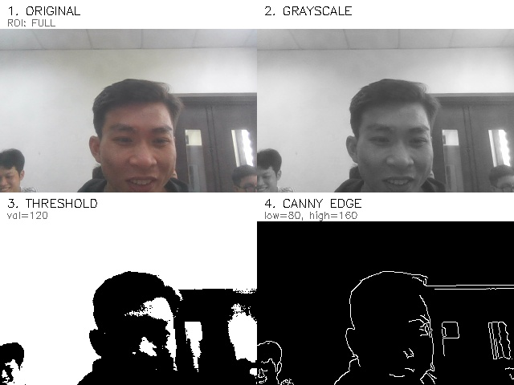
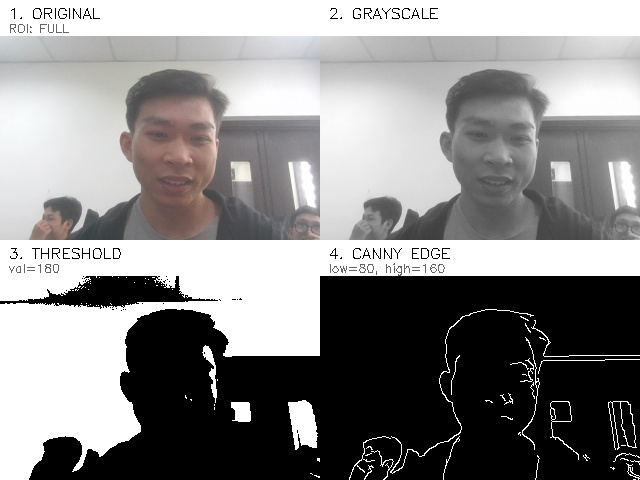 

---

# 9.5 Thử nghiệm Canny Edge

## Bộ tham số thử nghiệm

* 50/100
* 80/160
* 150/250

## Kết quả

| Canny Edge | Kết quả                   |
| ---------- | ------------------------- |
| 50/100     | Nhiều biên, nhiễu cao     |
| 80/160     | Biên tương đối ổn định    |
| 150/250    | Biên ít, mất chi tiết nhỏ |

## Nhận xét

Canny quá nhạy sẽ sinh nhiều cạnh giả và gây cảnh báo sai.

Ảnh minh chứng:

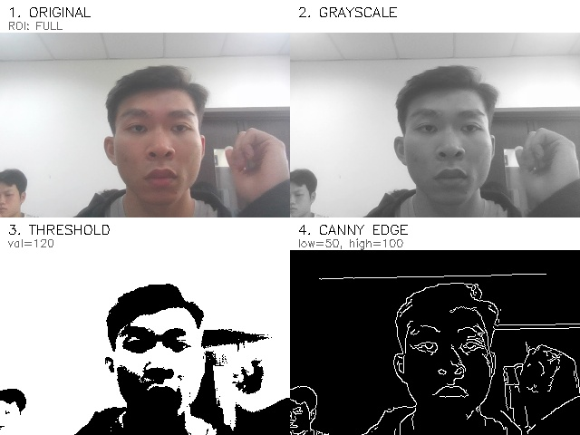 
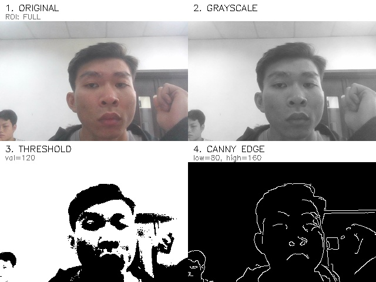 
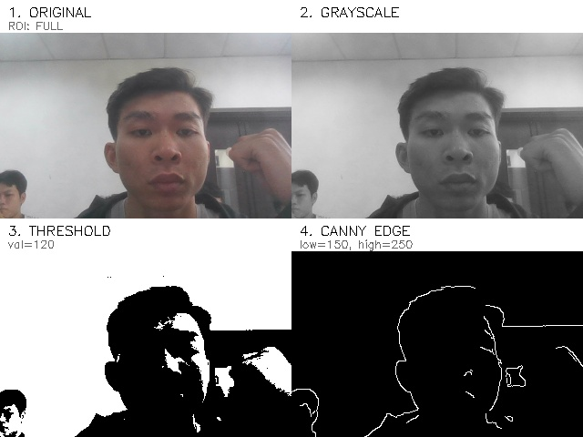

---

# 9.6 Motion Detection nâng cao

## Các tham số thử nghiệm

### Motion Diff Threshold

* 15
* 25
* 40

### Min Area

* 500
* 800
* 1500

### Cooldown

* 0 giây
* 1 giây
* 5 giây

---

## Kết quả quan sát

| Cấu hình       | Kết quả                         |
| -------------- | ------------------------------- |
| Threshold thấp | Nhạy với chuyển động nhỏ        |
| Threshold cao  | Có thể bỏ sót chuyển động       |
| Min Area thấp  | Sinh quá nhiều event            |
| Cooldown dài   | Giảm spam event nhưng dễ bỏ sót |

---

## Nhận xét kỹ thuật

Hệ thống cần cân bằng giữa:

* Độ nhạy phát hiện
  và
* Khả năng giảm false positive

Nếu tham số quá nhạy:

* Hệ thống tạo nhiều cảnh báo giả

Nếu tham số quá cao:

* Hệ thống bỏ sót sự kiện thật

---

# 9.7 Parameter Experiment Log

File:

```text id="4y5q11"
outputs/parameter_experiment_log.csv
```

Thông tin log gồm:

* Threshold
* ROI
* Edge parameters
* Motion threshold
* Blur score
* Brightness score
* Event result

Vai trò:

Parameter log giúp:

* Truy vết cấu hình
* Phân tích lỗi
* Kiểm chứng cảnh báo
* Tối ưu pipeline AIoT

Ảnh minh chứng:

```text id="5r5ihw"
outputs/images/parameter_log.jpg
```

---

# 9.8 Phân tích code nâng cấp

## compute_brightness()

* Tính độ sáng trung bình

## compute_blur_score()

* Đánh giá độ sắc nét ảnh

## crop_roi()

* Cắt vùng ROI

## create_processed_contact_sheet()

* Tạo ảnh tổng hợp nhiều bước xử lý

## event_from_quality()

* Sinh event:

  * LOW_LIGHT
  * BLURRY_IMAGE
  * IMAGE_QUALITY_OK

## motion_capture_advanced()

* Tính motion score
* Sinh motion event

---

# 9.9 Nhận xét kỹ thuật nâng cao

Qua quá trình thử nghiệm tham số, em nhận thấy:

* Một thay đổi nhỏ của threshold có thể làm event thay đổi hoàn toàn
* ROI giúp giảm nhiễu nhưng có nguy cơ bỏ sót vùng ngoài camera
* Motion detection không phải object detection
* Brightness và blur ảnh hưởng lớn đến độ tin cậy AI pipeline
* Việc ghi parameter log là cần thiết để truy vết và kiểm chứng hệ thống AIoT

---

# 9.10 Kết luận phần nâng cấp

Phiên bản nâng cấp giúp hệ thống AIoT:

* Ổn định hơn
* Có khả năng phân tích chất lượng ảnh
* Có khả năng đánh giá độ tin cậy visual event
* Chuẩn bị dữ liệu tốt hơn cho Lab 7 Object Detection

Ngoài việc xử lý ảnh, hệ thống còn có khả năng:

* phân tích tham số,
* đánh giá chất lượng dữ liệu,
* kiểm soát false positive,
* và truy vết cấu hình xử lý ảnh.
