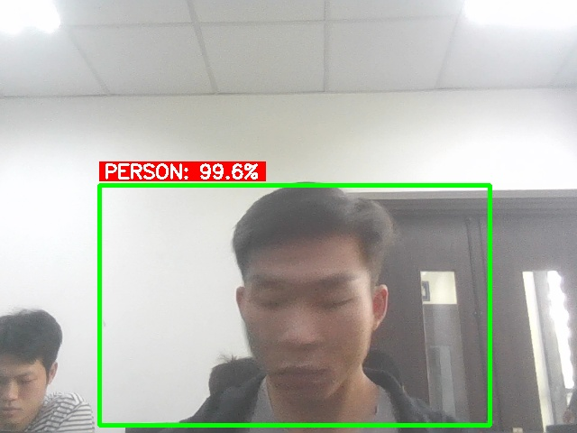

# Lab 6 Upgrade - AI Vision with Faster R-CNN

Phiên bản `Lab_upgrade` là bản nâng cấp của Lab 6: từ xử lý ảnh cơ bản sang phát hiện đối tượng bằng AI với Faster R-CNN, kết hợp phát hiện chuyển động và phân loại `person` / `animal` trên luồng camera.

## Tính năng chính

- ✅ `app.py` chạy FastAPI, cung cấp dashboard và API cho stream, motion status, detections và events.
- ✅ Phát hiện đối tượng bằng `Faster R-CNN` của `torchvision`.
- ✅ Xử lý AI bất đồng bộ để giữ cho luồng video mượt mà.
- ✅ Phát hiện chuyển động trước khi gửi frame vào AI, giảm tải và chỉ ghi snapshot khi thực sự có thay đổi.
- ✅ Phân biệt `person` và `animal`, đồng thời lưu bounding box + nhãn lên ảnh.
- ✅ Lưu ảnh kết quả vào `data/snapshots/`.
- ✅ Ghi log AI detection vào `outputs/ai_detection_log.csv`.
- ✅ Ghi event phát hiện vào `outputs/image_event_log.csv`.

## Cấu trúc thư mục

- `app.py`               - backend FastAPI, stream camera, motion detection, AI inference.
- `index.html`           - giao diện dashboard hiện đại.
- `data/snapshots/`      - ảnh snapshot AI đã xử lý.
- `outputs/ai_detection_log.csv`   - log chi tiết phát hiện AI.
- `outputs/image_event_log.csv`   - log event từ motion và AI.

## Chạy ứng dụng

1. Tạo môi trường ảo và cài dependencies:

```bash
python -m venv .venv
source .venv/bin/activate
pip install fastapi uvicorn[standard] opencv-python pillow numpy torch torchvision
```

2. Chạy server:

```bash
uvicorn app:app --reload --host 0.0.0.0 --port 8000
```

3. Mở trình duyệt tại:

```text
http://127.0.0.1:8000/
```

4. Kiểm tra API docs (nếu cần):

```text
http://127.0.0.1:8000/docs
```

## Endpoint chính

- `/`               - dashboard giao diện chính.
- `/video_feed`     - luồng video gắn motion detection và AI overlay.
- `/motion-status`  - trạng thái motion và cảnh báo.
- `/detections`     - danh sách phát hiện AI gần nhất.
- `/events`         - danh sách event gần nhất.
- `/latest-snapshot`- ảnh snapshot AI mới nhất.

## Kết quả mẫu

Ảnh kết quả snapshot được lưu trong `data/snapshots/`:



Trong ví dụ này, hệ thống đã phát hiện `PERSON` với độ tin cậy cao và vẽ bounding box, nhãn cảnh báo trên ảnh.

## Ghi chú

- Nếu không cài được `torch` / `torchvision`, ứng dụng vẫn có thể chạy nhưng không thực hiện được AI detection.
- Bản nâng cấp này tập trung vào: phát hiện đối tượng thực, xử lý bất đồng bộ để tránh lag, và tạo log + event để quan sát kết quả.
