# BÁO CÁO LAB 7 – OBJECT DETECTION / IMAGE AI INTEGRATION

## Thông tin sinh viên

* Họ và tên: Nguyễn Quang Vinh
* MSSV: 1771020760
* Ngày thực hiện: 16/06/2026

---

# 1. Mục tiêu Lab

Lab 7 mở rộng từ Lab 6 bằng cách tích hợp mô hình Object Detection vào hệ thống AIoT Camera.

Hệ thống thực hiện:

* Nhận frame từ camera hoặc ảnh upload.
* Chạy Object Detection bằng YOLO.
* Sinh:

  * Class
  * Confidence
  * Bounding Box
* Tạo ảnh annotated.
* Ghi detection log.
* Sinh vision event cho lớp Decision/Reasoning.

---

# 2. Môi trường thực hiện

## Phiên bản phần mềm

| Thành phần   | Giá trị |
| ------------ | ------- |
| Python       | 3.12.0     |
| OpenCV       | 4.10.0     |
| FastAPI      | 0.127.0     |
| Ultralytics  | 8.4.68     |
| Hệ điều hành | Window/Linux     |

---

# 3. Cài đặt hệ thống

## Bước 1: Tạo môi trường ảo

```bash
python -m venv .venv
```

Kích hoạt:

### Windows

```bash
.venv\Scripts\activate
```

### Linux/WSL

```bash
source .venv/bin/activate
```

---

## Bước 2: Cài đặt thư viện

```bash
pip install -r requirements.txt
```

---

# 4. Kiểm tra Pipeline

## Chạy Demo

```bash
python run_lab7_demo.py
```

### Kết quả mong đợi

File:

```text
RUN_TEST_LOG.txt
```

chứa:

```text
LOCAL_PIPELINE_TEST_PASS
{
  "annotated_image_exists": true,
  "detection_log_exists": true,
  "vision_event_log_exists": true,
  "backend": "ultralytics",
  "num_detections": 1
}
```

---

## Kiểm tra ảnh Annotated

Thư mục:

```text
data/annotated_images/
```

### Kết quả

Xuất hiện ít nhất một ảnh được vẽ bounding box.

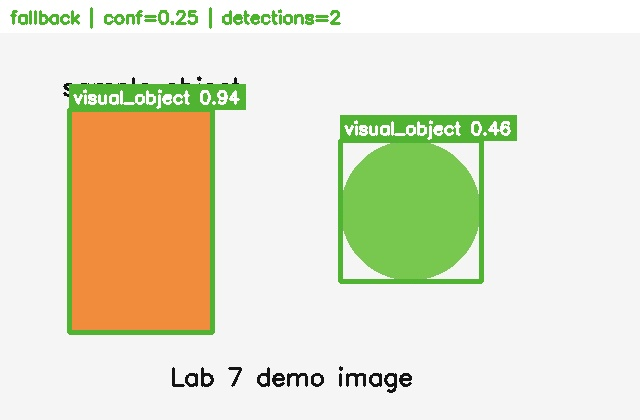

---

## Kiểm tra Vision Event

File:

```text
outputs/vision_event_log.csv
```

### Kết quả

Có event mới được sinh ra.
```text
evt_eaf0cfbadc,img_c7d8a90b01,2026-06-16T11:49:45,LOW_CONFIDENCE_REVIEW,WARNING,frisbee,0.3897,low_confidence_rule,Detected object has low confidence; human review is recommended.,Display annotated image on dashboard; do not trigger actuator without a safety rule.,data/annotated_images/img_c7d8a90b01_detected.jpg
```

---

# 5. Chạy Dashboard

## Khởi động Service

```bash
uvicorn app:app --reload --host 0.0.0.0 --port 8000
```

---

## Mở Dashboard

Truy cập:

```text
http://127.0.0.1:8000/
```

### Kết quả

Dashboard hiển thị đầy đủ các chức năng:

* Stream Camera
* Snapshot Detect
* Upload Detect
* Threshold
* Class Filter

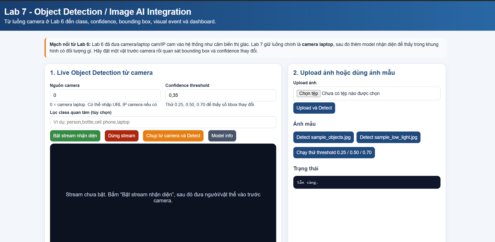

---

# 6. Live Object Detection

## Bật Camera

Thiết lập:

```text
source = 0
```

Bấm:

```text
Bật Stream
```

### Kết quả

Camera laptop hoạt động.

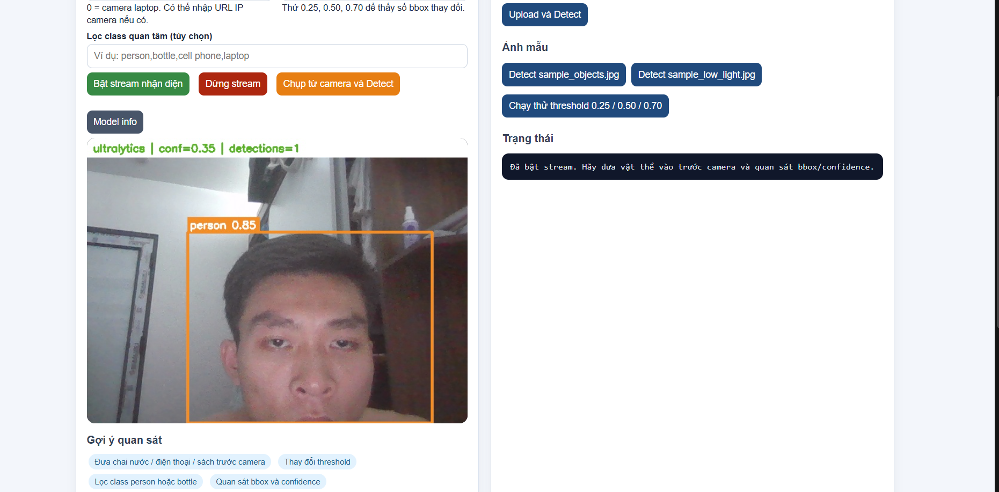

---

## Nhận diện vật thể

Đưa vật thể vào camera:

* Chai nước
* Điện thoại
* Laptop
* Người

### Kết quả

Model trả về:

* Class
* Confidence
* Bounding Box

Ví dụ:

```text
person 0.95
```

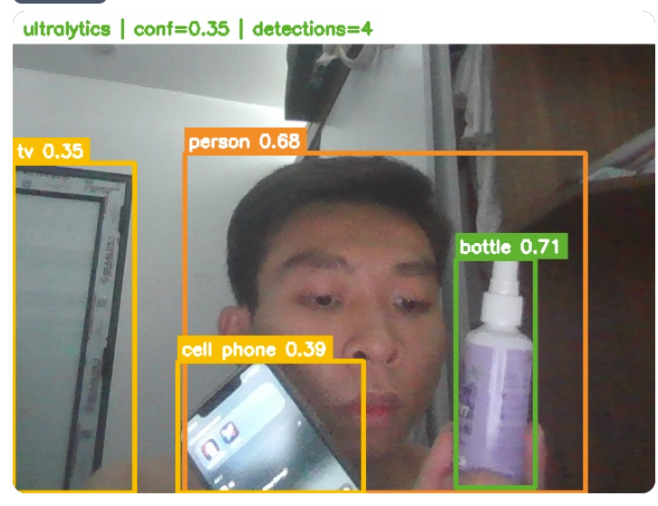

---

# 7. Chụp Snapshot Detect

Bấm:

```text
Chụp từ camera và Detect
```

### Kết quả

Sinh:

```text
data/input_images/
```

và

```text
data/annotated_images/
```

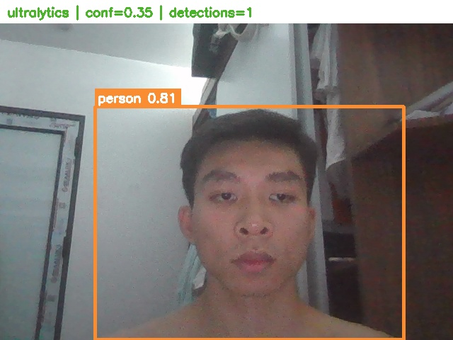 


---

# 8. Upload Ảnh

Chọn ảnh bất kỳ.

Bấm:

```text
Upload and Detect
```

### Kết quả

Ảnh được nhận diện và hiển thị Bounding Box.

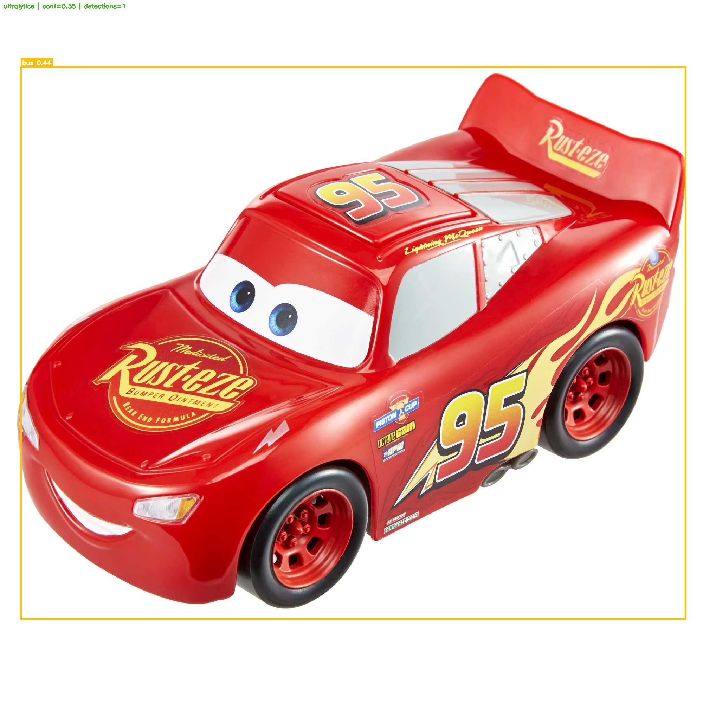 
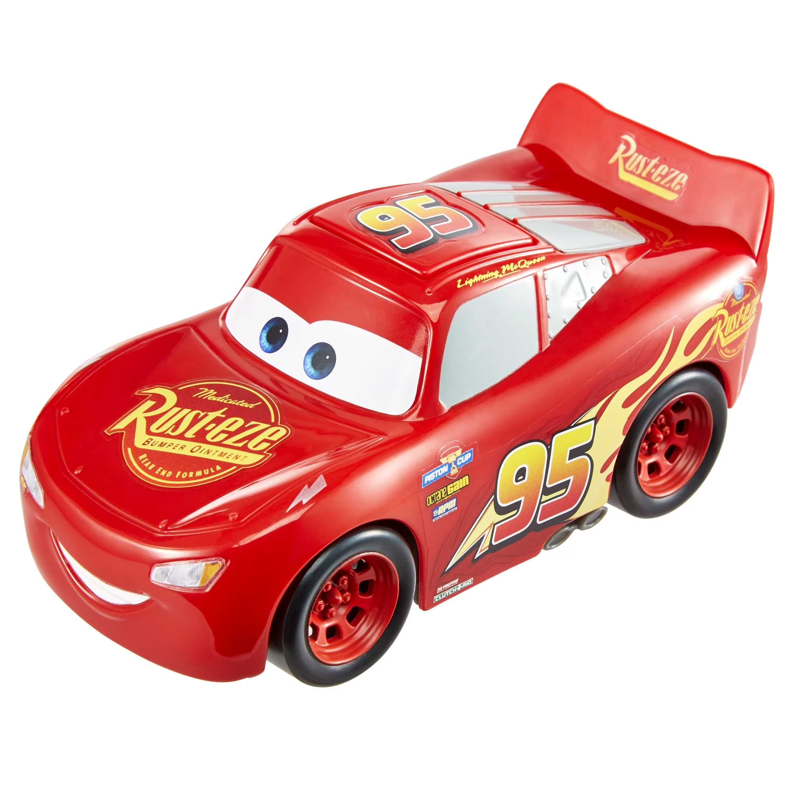

---

# 9. Thí nghiệm Threshold

## Threshold = 0.25

### Quan sát

* Nhiều Bounding Box hơn.
* Nhạy hơn.
* Dễ False Positive.

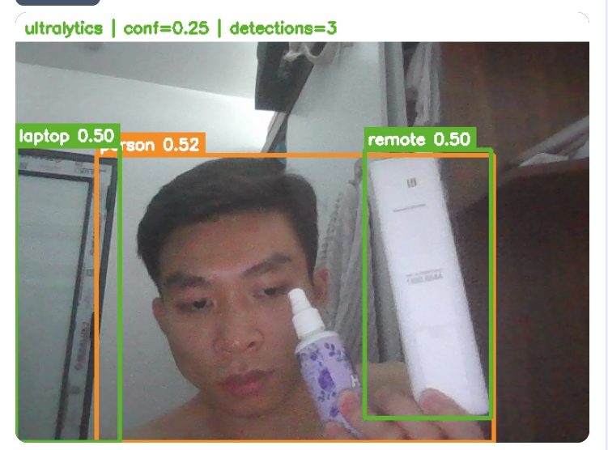

---

## Threshold = 0.50

### Quan sát

* Cân bằng giữa độ nhạy và độ chính xác.

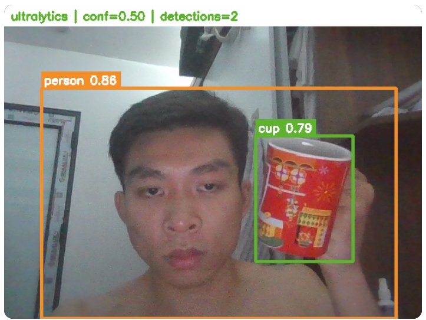

---

## Threshold = 0.70

### Quan sát

* Ít Bounding Box hơn.
* Thận trọng hơn.
* Có nguy cơ bỏ sót vật thể.

---

## Nhận xét

| Threshold | Đặc điểm                      |
| --------- | ----------------------------- |
| 0.25      | Nhạy, nhiều false positive    |
| 0.50      | Cân bằng                      |
| 0.70      | Chính xác hơn nhưng dễ bỏ sót |

---

# 10. Thí nghiệm Class Filter

## Filter Person

```text
person
```

### Kết quả

Chỉ hiển thị lớp person.

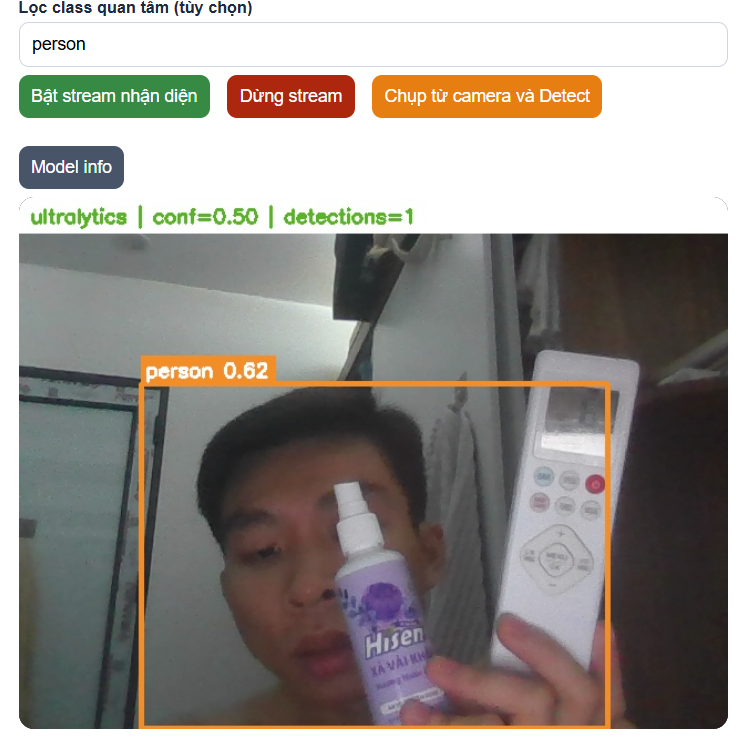

---

## Filter Bottle

```text
bottle
```

### Kết quả

Chỉ hiển thị chai nước.

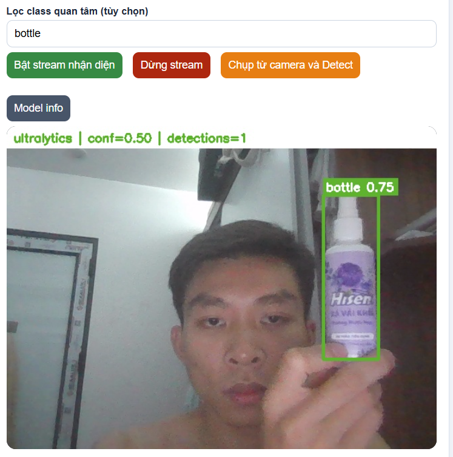

---

# 11. Phân tích Detection Log

File:

```text
outputs/detection_log.csv
```

## Kết quả

| timestamp | model_version | threshold_used | class_name | confidence |
| --------- | ------------- | -------------- | ---------- | ---------- |
| 2026-06-15T09:16:36 | fallback_v1 | 0.25 | visual_object | 0.9376 |
| 2026-06-15T09:16:36 | fallback_v1 | 0.25 | visual_object | 0.4604 |
| 2026-06-16T11:48:31 | lab7_yolo_nano_v1 | 0.25 | frisbee | 0.3897 |
| 2026-06-17T21:49:48 | lab7_yolo_nano_v1 | 0.35 | person | 0.8056 |
| 2026-06-17T21:53:40 | lab7_yolo_nano_v1 | 0.35 | bus | 0.4358 |

## Ý nghĩa các trường

| Trường            | Ý nghĩa            | Giá trị trong dữ liệu |
| ----------------- | ------------------ | ---------------------- |
| timestamp         | Thời gian nhận diện | 2026-06-15T09:16:36 / 2026-06-16T11:48:31 / 2026-06-17T21:49:48 / 2026-06-17T21:53:40 |
| detection_id      | ID duy nhất của lần phát hiện | det_32a489656d, det_fec4a94456, det_1281bc4edd, det_aa73586832, det_df3d6aa18b |
| image_id          | ID của ảnh nguồn | img_551c969269, img_936102c404, img_79f0aa27be, img_3718bacdcf |
| source_type       | Nguồn dữ liệu đầu vào | demo_script, camera, upload |
| model_name        | Tên model | fallback_contour_detector, yolov8n.pt |
| model_version     | Phiên bản model sử dụng | fallback_v1, lab7_yolo_nano_v1 |
| threshold_used    | Ngưỡng tin cậy tối thiểu để chấp nhận | 0.25, 0.35 |
| class_name        | Tên đối tượng được phát hiện | visual_object, frisbee, person, bus |
| confidence        | Độ tin cậy của dự đoán (0-1) | 0.9376, 0.4604, 0.3897, 0.8056, 0.4358 |
| bbox_x1, bbox_y1, bbox_x2, bbox_y2 | Tọa độ box chứa vật thể (tọa độ pixel) | (69,109,212,332), (340,140,481,281), (340,140,480,281), (134,150,570,479), (59,190,1950,1761) |
| inference_time_ms | Thời gian suy luận (miligiây) | 22.12, 206.04, 86.98, 142.9 |
| annotated_image_path | Đường dẫn ảnh đã đánh dấu kết quả | data/annotated_images/... |


---

# 12. Phân tích Vision Event

File:

```text
outputs/vision_event_log.csv
```

## Ví dụ

| event_type      | severity |
| --------------- | -------- |
| OBJECT_DETECTED | LOW      |
| PERSON_DETECTED | HIGH     |


---

## Vai trò

Chuyển output AI thành sự kiện để hệ thống Decision hoặc Rule Engine sử dụng.

Ví dụ:

```text
person 0.95
```

↓

```text
PERSON_DETECTED
```

↓

```text
Decision Layer
```

---

# 13. Các trường hợp nhận đúng

## Trường hợp 1

* Ánh sáng tốt.
* Vật thể rõ ràng.
* Khoảng cách gần.

Kết quả:

```text
confidence > 0.9
```

---

## Trường hợp 2

* Người đứng chính diện.

Kết quả:

```text
person
```

được nhận diện chính xác.

---

## Trường hợp 3

* Chai nước lớn trong khung hình.

Kết quả:

```text
bottle
```

được nhận diện ổn định.

---

# 14. Các trường hợp nhận sai

## Trường hợp 1

Ánh sáng yếu.

Kết quả:

* Confidence giảm.
* Bỏ sót vật thể.

---

## Trường hợp 2

Vật thể quá xa.

Kết quả:

* Bounding Box nhỏ.
* Khó nhận diện.

---

## Trường hợp 3

Vật thể bị che khuất.

Kết quả:

* Nhận nhầm class.
* Confidence thấp.

---

# 15. Trả lời câu hỏi hiểu bản chất

## 1. Lab 7 kế thừa những thành phần nào từ Lab 6?

Camera stream, snapshot, video capture, dashboard, metadata và event logging.

## 2. Motion Detection khác Object Detection như thế nào?

Motion Detection chỉ phát hiện có chuyển động. Object Detection xác định vật thể cụ thể và vị trí của nó.

## 3. Image Classification khác Object Detection thế nào?

Classification chỉ trả về nhãn ảnh. Object Detection trả về nhãn và vị trí vật thể.

## 4. Bounding Box giúp dashboard hiểu điều gì?

Xác định vị trí và kích thước của vật thể trong ảnh.

## 5. Confidence có phải xác suất đúng tuyệt đối không?

Không. Đây là mức độ tin tưởng của model.

## 6. Threshold quá thấp gây gì?

Nhiều False Positive.

## 7. Threshold quá cao gây gì?

Bỏ sót vật thể thật.

## 8. Vì sao lưu model_version?

Để truy vết model nào tạo ra kết quả.

## 9. Vì sao lưu threshold_used?

Để biết cấu hình inference tại thời điểm chạy.

## 10. Vì sao đo inference_time_ms?

Đánh giá khả năng chạy thời gian thực.

## 11. Vì sao model output chưa phải quyết định điều khiển?

Cần qua lớp rule, safety và decision.

## 12. Khi nào cần LOW_CONFIDENCE_REVIEW?

Khi confidence thấp hoặc kết quả không chắc chắn.

## 13. Camera mờ hoặc tối làm model sai thế nào?

Confidence giảm, nhận nhầm hoặc bỏ sót.

## 14. COCO có phù hợp nhận diện bệnh lá cây không?

Không. COCO không được huấn luyện cho bệnh lá cây.

## 15. Lab 7 tạo dữ liệu gì cho Lab 8?

Detection Log, Vision Event, Confidence, Bounding Box, Latency và Metadata.

---

# 16. Kết luận

Lab 7 đã tích hợp thành công mô hình Object Detection vào hệ thống AIoT Camera.

Hệ thống có khả năng:

* Nhận diện vật thể thời gian thực.
* Sinh Bounding Box và Confidence.
* Ghi Detection Log.
* Tạo Vision Event.
* Hỗ trợ tầng Reasoning và Decision của Lab 8.

Threshold ảnh hưởng trực tiếp đến độ nhạy và độ chính xác của hệ thống. Trong quá trình thử nghiệm, giá trị 0.50 cho kết quả cân bằng nhất giữa false positive và missed detection.
