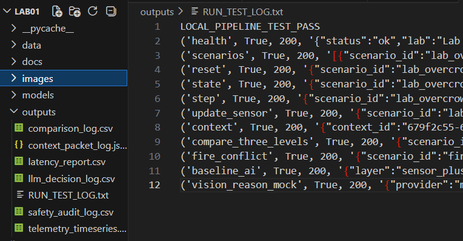
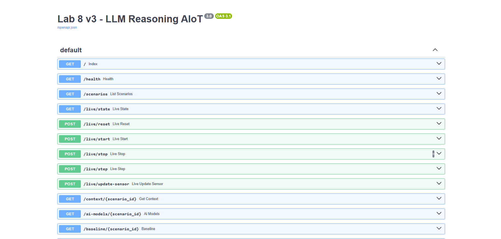
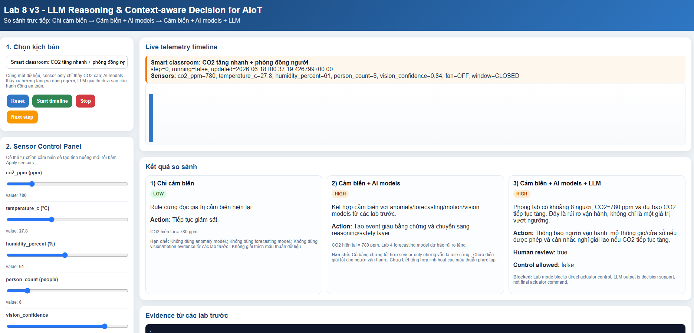
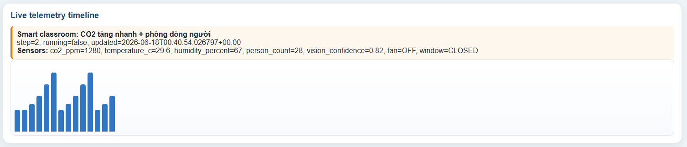
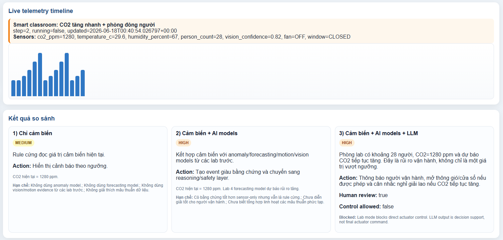
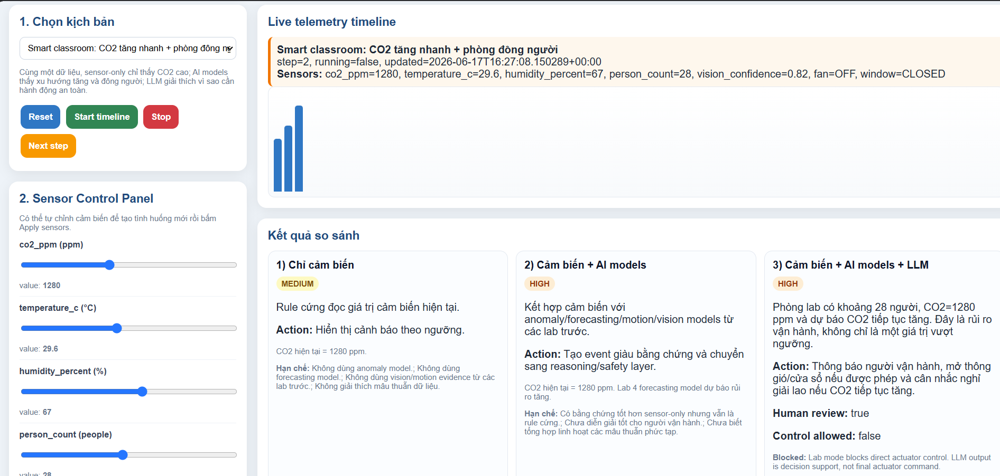
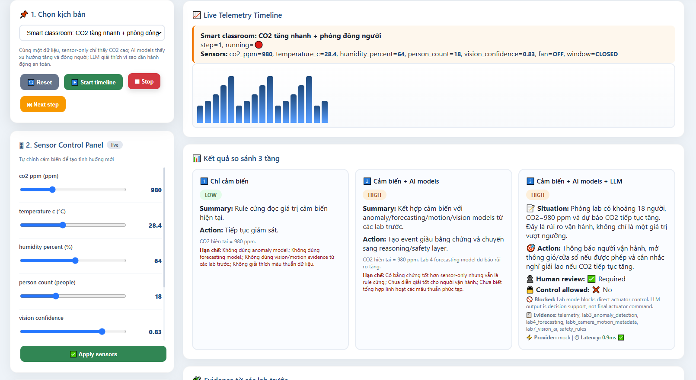
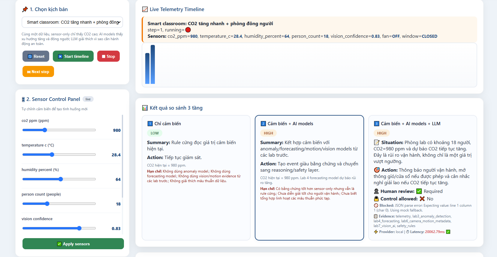

# BÁO CÁO LAB 8 v3

# LLM REASONING & CONTEXT-AWARE DECISION FOR AIoT

---

## Thông tin sinh viên

* Họ tên: Nguyễn Quang Vinh
* MSSV: 1771020760
* Ngày thực hiện: 18/06/2026

---

# 1. Mục tiêu bài lab

Lab 8 v3 tập trung vào việc tích hợp Large Language Model (LLM) vào hệ thống AIoT nhằm thực hiện suy luận (reasoning), giải thích tình huống và hỗ trợ ra quyết định dựa trên dữ liệu cảm biến cùng các mô hình AI đã xây dựng ở các bài lab trước.

Các mục tiêu đạt được:

* Chạy được dashboard AIoT có sensor timeline.
* So sánh 3 tầng xử lý:

  * Sensor Only
  * Sensor + AI Models
  * Sensor + AI Models + LLM
* Hiểu vai trò của anomaly detection, forecasting và vision AI trong việc cung cấp evidence cho LLM.
* Hiểu context packet, prompt engineering và JSON schema output.
* Hiểu cơ chế safety gate.
* Tìm hiểu local LLM và quantization.

---

# 2. Môi trường thực hiện

* Python: 3.x
* FastAPI
* Uvicorn
* Pydantic
* Requests
* HTTPX

---

# 3. Cấu trúc project

```text
lab8_llm_reasoning_v3_live_aiot/

├── app.py
├── index.html
├── run_lab8_demo.py
├── requirements.txt
├── outputs/
│   ├── telemetry_timeseries.csv
│   ├── context_packet_log.jsonl
│   ├── comparison_log.csv
│   ├── llm_decision_log.csv
│   ├── safety_audit_log.csv
│   └── latency_report.csv
```

Vai trò các thành phần:

| Thành phần       | Chức năng        |
| ---------------- | ---------------- |
| app.py           | Backend FastAPI  |
| index.html       | Dashboard        |
| run_lab8_demo.py | Smoke Test       |
| outputs          | Lưu log hệ thống |

---

# 4. Các bước thực hiện

## Bước 1: Tạo môi trường ảo

```bash
python -m venv .venv
```

Windows:

```bash
.venv\Scripts\activate
```

Linux/macOS:

```bash
source .venv/bin/activate
```

---

## Bước 2: Cài đặt thư viện

```bash
pip install -r requirements.txt
```

### Kết quả

Hệ thống cài đặt thành công các thư viện:

* fastapi
* uvicorn
* pydantic
* requests
* httpx
* python-multipart

---

## Bước 3: Chạy Smoke Test

```bash
python run_lab8_demo.py
```

### Kết quả

```text
LOCAL_PIPELINE_TEST_PASS
```

Smoke test PASS chứng tỏ toàn bộ pipeline backend hoạt động bình thường.

### Minh chứng



---

## Bước 4: Khởi động hệ thống

```bash
uvicorn app:app --reload --host 0.0.0.0 --port 8000
```

Truy cập:

```text
http://127.0.0.1:8000
```

Kiểm tra Swagger:

```text
http://127.0.0.1:8000/docs
```

### Minh chứng



---

# 5. Kiểm tra Dashboard

Sau khi mở Dashboard thành công, giao diện hiển thị:

* Sensor Panel
* Timeline
* Compare 3 Levels
* Scenario Selector

### Minh chứng



---

# 6. Thực hiện kịch bản Smart Classroom

## Kịch bản

* CO2 tăng nhanh
* Nhiều người trong phòng
* Quạt tắt

### Các bước

1. Chọn Smart Classroom
2. Reset Scenario
3. Bấm Next Step nhiều lần
4. Quan sát giá trị cảm biến thay đổi

### Minh chứng



---

# 7. So sánh ba tầng xử lý

## 7.1 Sensor Only

Đầu vào:

* CO2
* Nhiệt độ
* Person Count

Cách xử lý:

```text
Rule-based Threshold
```

Ví dụ:

```text
CO2 > 1500 ppm
=> Warning
```

### Hạn chế

* Không biết xu hướng tương lai.
* Không biết dữ liệu bất thường.
* Không hiểu ngữ cảnh.

---

## 7.2 Sensor + AI Models

Bổ sung:

### Lab 3

Anomaly Detection

```text
anomaly_score
```

### Lab 4

Forecasting

```text
forecast_result
risk_trend
```

### Lab 6

Motion Detection

```text
motion_event
metadata
```

### Lab 7

Vision AI

```text
class
confidence
bbox
```

Kết quả:

```text
Risk Assessment chính xác hơn.
```

---

## 7.3 Sensor + AI Models + LLM

LLM nhận:

```json
{
  "telemetry": {},
  "evidence": {},
  "safety_rules": []
}
```

LLM tạo:

```json
{
  "situation_summary": "",
  "risk_level": "",
  "recommended_action": ""
}
```

### Kết quả

* Có giải thích.
* Có reasoning.
* Có đề xuất hành động.

### Minh chứng



---

# 8. Thực hiện tình huống rủi ro cao

Thiết lập:

| Sensor       | Giá trị  |
| ------------ | -------- |
| CO2          | 2200 ppm |
| Person Count | 45       |
| Fan          | OFF      |
| Window       | CLOSED   |

Sau đó:

```text
Apply Sensors
```

### Kết quả

Sensor Only:

```text
CO2 vượt ngưỡng
```

AI Models:

```text
Anomaly cao
Forecast tiếp tục tăng
```

LLM:

```text
Không khí kém
Nguy cơ giảm tập trung
Khuyến nghị mở cửa và bật quạt
```

### Minh chứng



---

# 9. Chạy Timeline tự động

Bấm:

```text
Start Timeline
```

Hệ thống tự động cập nhật dữ liệu cảm biến theo thời gian.

Quan sát:

* CO2 tăng dần
* Nhiệt độ thay đổi
* Person Count thay đổi

Sau đó:

```text
Stop Timeline
```

### Minh chứng



---

# 10. Context Packet

Trong hệ thống AIoT, LLM không nhận một câu hỏi đơn lẻ.

LLM nhận một Context Packet có cấu trúc:

```json
{
  "telemetry": {},
  "evidence_from_previous_labs": {
    "lab3": {},
    "lab4": {},
    "lab6": {},
    "lab7": {}
  },
  "safety_rules": [],
  "output_schema": {}
}
```

Ưu điểm:

* Có cấu trúc.
* Dễ mở rộng.
* Giảm hallucination.
* Dễ kiểm soát.

---

# 11. JSON Schema Output

Ví dụ:

```json
{
  "situation_summary": "High CO2 concentration",
  "risk_level": "HIGH",
  "recommended_action": "Open windows",
  "control_allowed": false,
  "need_human_review": true
}
```

Lợi ích:

* Backend dễ parse.
* Dễ validation.
* Dễ audit.
* Dễ lưu log.

---

# 12. Safety Gate

Sau khi LLM tạo quyết định, hệ thống tiếp tục kiểm tra:

```text
LLM Output
    ↓
Safety Gate
    ↓
Final Decision
```

Vai trò:

* Chặn hành động nguy hiểm.
* Kiểm tra logic.
* Kiểm tra confidence.
* Yêu cầu Human Review nếu cần.

---

# 13. Kiểm tra file log

## telemetry_timeseries.csv

Lưu dữ liệu cảm biến theo thời gian.

### Minh chứng

[Telemetry Log](outputs/telemetry_timeseries.csv)

---

## comparison_log.csv

Lưu kết quả so sánh 3 tầng.

### Minh chứng

[Comparison Log](outputs/comparison_log.csv)

---

## context_packet_log.jsonl

Lưu toàn bộ context gửi cho LLM.

### Minh chứng

[Context Packet](outputs/context_packet_log.jsonl)

---

## llm_decision_log.csv

Lưu quyết định của LLM.

### Minh chứng

[LLM Decision](outputs/llm_decision_log.csv)

---

## safety_audit_log.csv

Lưu kết quả Safety Gate.

### Minh chứng

[Safety Audit](outputs/safety_audit_log.csv)

---

# 14. Local LLM và Quantization

## Mô hình sử dụng

Ví dụ:

```bash
ollama pull qwen3:1.7b
```

Hoặc:

```bash
ollama pull gemma3:1b
```

---

## Quantization

Ví dụ:

```text
Q4_K_M
Q5_K_M
Q8_0
```

Tác dụng:

* Giảm RAM.
* Giảm VRAM.
* Chạy được trên laptop.
* Tăng tốc inference.



---

# 15. Trả lời câu hỏi phân tích

## Câu 1

Nếu có LLM rồi, vì sao vẫn cần anomaly detection?

### Trả lời

Anomaly Detection phát hiện dữ liệu bất thường bằng mô hình học máy chuyên dụng. LLM không được thiết kế để thay thế thuật toán phát hiện bất thường và cần anomaly score làm bằng chứng để reasoning.

---

## Câu 2

Nếu có LLM rồi, vì sao vẫn cần forecasting?

### Trả lời

Forecasting dự đoán xu hướng tương lai. LLM không phải mô hình dự báo chuỗi thời gian nên cần kết quả forecast để đánh giá rủi ro trong tương lai.

---

## Câu 3

Nếu có LLM rồi, vì sao vẫn cần camera và vision AI?

### Trả lời

LLM không trực tiếp thực hiện object detection hoặc image classification. Vision AI cung cấp các đối tượng, confidence và bounding box để LLM suy luận.

---

## Câu 4

Trong fire_alarm_conflict, vì sao Sensor Only dễ cảnh báo sai?

### Trả lời

Sensor Only chỉ dựa vào ngưỡng đơn lẻ nên không phát hiện được mâu thuẫn giữa các nguồn dữ liệu. LLM có thể tổng hợp nhiều evidence để yêu cầu human review.

---

## Câu 5

Trong fall_or_bending_ambiguity, vì sao cần human review?

### Trả lời

Confidence chưa đủ cao để xác nhận té ngã. Safety Gate yêu cầu con người xác minh trước khi đưa ra hành động.

---

## Câu 6

Context Packet khác prompt tự do như thế nào?

### Trả lời

Context Packet có cấu trúc rõ ràng gồm telemetry, evidence và safety rules; prompt tự do thường thiếu chuẩn hóa.

---

## Câu 7

Vì sao output cần JSON schema?

### Trả lời

Để backend parse, validate và lưu trữ kết quả một cách nhất quán.

---

## Câu 8

Safety Gate làm gì?

### Trả lời

Kiểm tra và xác thực quyết định từ LLM trước khi thực thi hành động.

---

## Câu 9

Quantization giúp gì?

### Trả lời

Giảm kích thước mô hình và giảm tài nguyên phần cứng cần thiết khi chạy local LLM.

---

## Câu 10

Khi nào dùng Cloud API và khi nào dùng Local LLM?

### Trả lời

* Cloud API: khi cần mô hình mạnh, tài nguyên lớn.
* Local LLM: khi cần riêng tư, không phụ thuộc Internet.

---

# 16. Kết luận

Lab 8 v3 giúp xây dựng hoàn chỉnh pipeline AIoT hiện đại gồm Sensor → AI Models → LLM → Safety Gate. Qua bài lab có thể thấy LLM không thay thế các mô hình AI trước đó mà hoạt động như một lớp reasoning tổng hợp bằng chứng để đưa ra quyết định có giải thích, có khả năng audit và đảm bảo an toàn hơn trong các hệ thống AIoT thực tế.

---

# Tài liệu đính kèm

## File log nộp bài

* outputs/telemetry_timeseries.csv
* outputs/context_packet_log.jsonl
* outputs/comparison_log.csv
* outputs/llm_decision_log.csv
* outputs/safety_audit_log.csv

## Hình ảnh minh chứng

* install_requirements.png
* smoke_test_pass.png
* dashboard_home.png
* smart_classroom.png
* compare_3_levels.png
* manual_sensor_test.png
* timeline_running.png
* telemetry_csv.png
* comparison_csv.png
* context_packet_log.png
* llm_decision_log.png
* safety_audit_log.png
